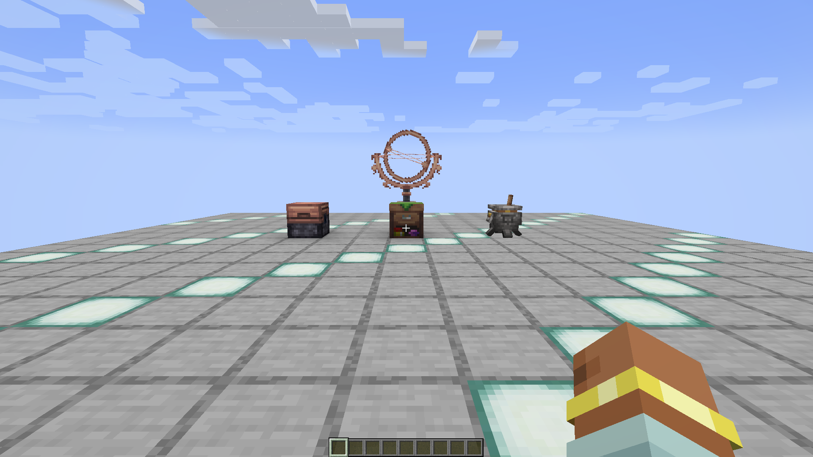
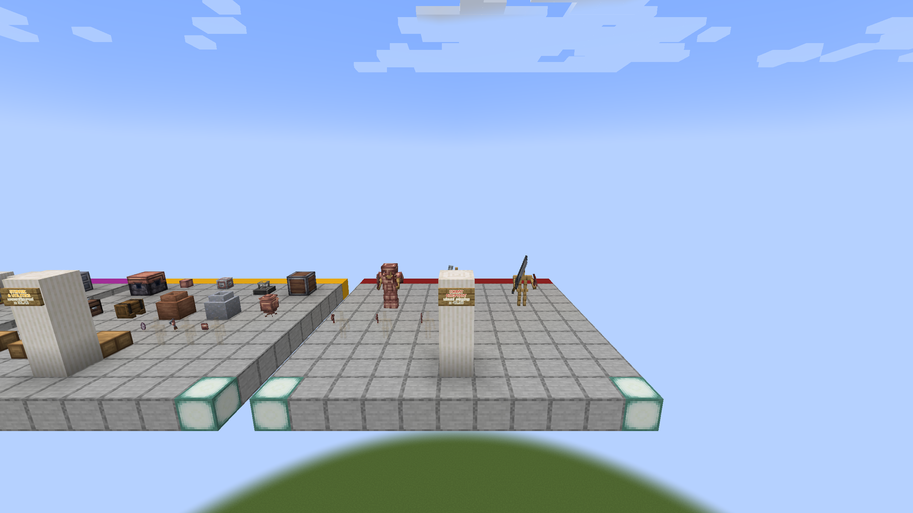

# Etherology original 1.21.1 reference baseline

This directory records the behaviour and presentation used to compare the
original Etherology release with the 1.20.1 port. Each mechanic directory owns
its setup, action, observation, screenshot, and port acceptance criterion.

## Reference identities must remain separate

### `published-0.1.7`

This is the only runtime-behaviour reference:

- Minecraft: `1.21.1`
- Fabric Loader: `0.17.3`
- Installed JAR: `Etherology-1.21-0.1.7.jar`
- JAR SHA-256:
  `38de3c1aad47fc715c2226266dec4c70c02d16370034a4e0350508131ac15c43`
- Repository-owned bundle SHA-256:
  `764bb85e398c3dca43f68a0d2c1eeecd0f3523da7a48adf48bcc5a967af4b91b`
- Source-commit binding: unavailable

The bundle pins eight top-level published JARs: Etherology, Fabric API, FabricShieldLib,
Biolith, Cardinal Components API, GeckoLib, owo-lib, and Trinkets. Quick Skin,
Customizable Player Models, Ears, and Architectury are excluded recursively.

The controller creates a new ignored, repository-owned runtime for each
one-shot capture. The accepted Slitherite v10 runtime remains immutable. The
Pedestal v11, v12, and v13 runtimes each consumed their only launch and remain
preserved. The prepared v14 contract will use a separate runtime:

```text
scripts/baseline/.state/runtimes/
  etherology-original-fabric-1.21.1-published-0.1.7-v11/  # consumed; never reuse
  etherology-original-fabric-1.21.1-published-0.1.7-v12/  # consumed; never reuse
  etherology-original-fabric-1.21.1-published-0.1.7-v13/  # consumed; never reuse
  etherology-original-fabric-1.21.1-published-0.1.7-v14/  # active; absent until provision
```

It never consults or mutates a launcher or user profile. The separately built
client-only v10 capture harness remains pinned in accepted history:

- JAR: `Etherology-Original-E2E-Harness-Fabric-1.21.1-1.3.5.jar`
- Size: `218,402` bytes
- SHA-256:
  `09e309f188da473b6038e35af4d1a7ed43409c0185c830e42dba506bfecb8489`
- Exact Etherology dependency: `=1.21-0.1.7`

That harness built reproducibly, remapped, and passed pure/artifact tests. The
consumed v10 runtime subsequently passed provision, stage, check, and its one
native `slitherite-block-registry` launch. The v11 Pedestal harness is v1.4.0;
its clean build and 47 Java tests passed, and its exact JAR is pinned at
`339,617` bytes with SHA-256
`09272e04b122b20da33d1964b4e1ca9f67af768fb0db0c0fa1f74f0579799e57`.
Its native run reached an integrated world but timed out before publishing any
report or screenshot, so it is not accepted Pedestal evidence. The compact v11
diagnostic record is under `docs/evidence/original-1.21.1/pedestal-v11`.

The v12 v1.4.1 harness passed 51 Java tests and two reproducible clean builds;
its `340,250`-byte JAR has SHA-256
`a99809d6443a4757c860e98d2f09e1d5775667a69e331a7e631930eb5728c7eb`.
Its sole native run then failed closed at client tick 155: all eight dispenser
fixtures at `x<0` remained unfired while all four at `x>=0` fired exactly once.
That exact chunk split indicates redstone-scheduled harness nondeterminism rather
than direction-specific Pedestal behavior as the best-supported inference; the
retained runtime cannot prove the scheduler cause conclusively. The harness
published a failed report and marker but no screenshot, then shutdown hung at
`Saving worlds` until the controller's 1,800-second timeout killed the owned
process group.
V12 is not accepted evidence; its compact diagnostic record is under
`docs/evidence/original-1.21.1/pedestal-v12`. The v13 v1.4.2 harness passed 51
Java tests and two reproducible clean builds; its `340,155`-byte JAR has
SHA-256
`82e443947ae46b20a6c1e3cc10aedeadb2ed34450cc929b22e9405e2b5c45e04`.
The `10,307`-byte v13 manifest has SHA-256
`61e9d189041a826bfc8375884e559c26a38bbb5e109eff5279b315374c91fe9c`,
and its `26,963`-byte verifier has SHA-256
`221afc8f88d11a60d94dc4bd94f1dd54b93e57cb93a387b336a8987d341afabe`.
Its sole native run completed the gallery and wrote only
`pedestal-gallery.png`, then timed out in the `transition-drops` client-mirror
stage. The failed report records 49 of 74 assertions true. The original client
and controller shut down cleanly, but the three missing later screenshots made
the run diagnostic and non-accepted; its compact archive is under
`docs/evidence/original-1.21.1/pedestal-v13`.

The prepared v14 v1.4.3 contract changes only the transient client item-entity
drop-map equality from a readiness/pass-fail condition into diagnostic data.
Authoritative server drops, the exact client block-state snapshot, all five
client block-entity/removal predicates, and all 74 assertions remain required.
Its 51 Java tests and two reproducible clean builds produced a `340,723`-byte
JAR with SHA-256
`9a329ff219f4403c8880597ed851a73843c74adf81ac4b5561b6708cf82129b6`.
The `10,307`-byte v14 manifest has SHA-256
`ddee58342b8a0e6c45bea375247243be5cc20bfa1680ef28f0d9ab5c72518962`,
and its `42,963`-byte verifier has SHA-256
`8f4775e95f2eea7595c53197f2032d4379c22efbcb046a2bfc44d4148c92a819`.
The v14 runtime is absent and has never been launched.
The earlier phase-zero runtime proof remains under
`docs/evidence/original-1.21.1/phase0-smoke-v1`.

The runtime contract also pins the official Minecraft version JSON, asset
index, client JAR, Fabric loader profile, and each of the eight Fabric library
JARs by exact byte identity. Its Mojang metadata represents a reproducible fresh
install observed in 2026, not release-day 2024 bytes. Because Fabric Meta stamps
the profile with each request time, the exact official response captured on
2026-08-30 is a separately hash-pinned repository fixture and its URL is retained
only as provenance. Provisioning copies that validated response and downloads
the libraries directly, without executing a Fabric installer or installing
Mojang's bundled Java runtime.

### `source-0.1.8`

This is a separate source and build reference:

- Upstream repository: <https://github.com/feytox/Etherology>
- Branch: `1.21`
- Commit: `70c0fcafb54f91ef715051dc1f6f7c77914e5805`
- Tree: `096d1c5b8f9033c5b96a9504508c306bce3834fc`
- Declared version: `1.21-0.1.8`
- Clean-export remapped JAR SHA-256:
  `d069a1dbc37d68d24174f700a03b68c6fbda98139052d02e59a7351ac0140f39`
- Clean-export sources JAR SHA-256:
  `b6b0ffc85d6d9d95d2f8daa8747747aaf2be765e6631f3b2e87f7093033271a3`

The clean export built with Java 21 and Fabric Loom `1.8.13` after retrying one
transient TLS EOF during an LWJGL native download. That result proves the exact
source tree builds. It does not prove a client run and does not bind the tree to
the published `0.1.7` binary.

Never combine facts from the two identities into one claim. A source reading
may explain what `source-0.1.8` implements; only evidence explicitly tied to the
hash-pinned `published-0.1.7` JAR may establish original runtime behaviour.

## Evidence rules

- Every runtime observation names `published-0.1.7` and its JAR hash.
- Screenshots are unedited Minecraft captures unless a file says otherwise.
- Every mechanic note identifies the setup, action, visible result, and porting
  acceptance criterion.
- Runtime logs and controller metadata stay with the same reference identity.
- A missing capture is an incomplete baseline, never evidence that a feature is
  absent.
- Source-only findings are labelled `source-0.1.8` and are not promoted to
  runtime findings.

## Capture status

The consumed v11 contract targeted `pedestal-baseline` with 74 assertions and
four planned 1920x1080 captures. It covers placement/shapes, block-entity
inventory and NBT, item/carpet interactions, item dispensing in all six
directions, empty-slot carpet dispensing in the four horizontal directions,
safe upward occupied-carpet fallthrough, full-target generic item ejection,
transition drops and retained server/client block-entity removal, and full
save/disconnect/reopen persistence. Hash-pinned published-bytecode inspection
anchors the unexecuted empty-slot `UP`/`DOWN` safety guard. Its exact v1.4.0
harness is built and hash-pinned. The one v11 launch reached a fresh integrated
world but exceeded the 1,800-second controller deadline before publishing a
report, completion marker, verification, or screenshot. Two saved player
snapshots and the pinned harness flow support a camera-readiness-loop diagnosis,
but it remains an inference and no native Pedestal result is claimed. V11 must
never be reused. V12 later reached the dispenser phase, where its exact
eight-unfired/four-fired chunk split indicated redstone-scheduled harness
nondeterminism as the best-supported inference; it published a failed report
and marker without a screenshot, then failed to shut down cleanly before the
controller timeout. V12 also must never be reused. V13 replaced the redstone
schedule with one explicit vanilla scheduled dispenser tick per fixture and
completed its gallery, but timed out waiting for the `transition-drops` client
mirror. It wrote only the gallery screenshot, reported 49 of 74 assertions
true, and shut down cleanly. V13 is diagnostic, not accepted, and must never be
reused. A fresh v14 profile with harness version 1.4.3 retains the authoritative
server drops, exact client block/block-entity predicates, and all 74 assertions
while recording transient client drop equality only as diagnostic data. Its
runtime is absent and has never been launched. See
[`pedestal`](mechanics/pedestal/README.md).

The first dedicated original Fabric 1.21.1 harness now implements
`phase0-smoke`. It creates a fresh deterministic integrated world, checks the
published resources, four block entries, and their four block-entity-type
entries, places the Brewing
Cauldron, Empowerment Table, Ethereal Storage, and Armillary Sphere, verifies
the exact server/client block-entity types, and records the world identity from
the live integrated server. Capture requires an exact first-person camera pose,
complete terrain, all four fixture positions rendering-ready, and 120
consecutive valid completed renders. The harness derives the logical window
request from the live macOS backing scale, then captures one unedited
`1920x1080` Minecraft framebuffer, force-saves, publishes a machine-verifiable
JSON report followed by a report-hash-bound completion marker, and schedules a
clean stop.

The controller pins the harness JAR independently of the eight published JARs,
stages an exact nine-JAR inventory, and rejects reused evidence, worlds, and
profiles that have consumed their one launch attempt. Before the first process
starts, an exclusive permanent seal binds the exact argv and pristine profile
snapshot; sanitized environment; complete selected JDK image; macOS
`caffeinate`; fully validated launcher wheel plus five pinned HTTP distributions;
two-node version metadata chain; exact 72-entry classpath; all 16 selected
native-classifier JARs; assets; staged artifact lock; and complete launcher file
input inventory. Native libraries may be extracted only into a fresh, bounded
repository-owned temporary directory outside the immutable launcher inputs.
Provisioning separately freezes downloaded inputs in a runtime lock before the
owned profile is atomically published. After exit, the verifier rehashes those
inputs and checks the extracted-native inventory, exact ordered assertion
contract, nonblank decoded PNG, report/marker digest and publication order,
nonempty `level.dat`, `session.lock`, exact `region/r.0.0.mca`, game log, empty
crash-report inventory, and clean shutdown. Its writable HOME, temporary state,
runtime, logs, and evidence all remain below the one repository-owned
selected `.state/runtimes/...-vN` directory.

Minecraft's `assets/skins` subtree is the one explicit mutable launcher output:
it must be absent before launch, is excluded from the immutable input hash, and
is accepted afterward only as a bounded, link-free, hash-shaped file inventory.
The controller hashes that inventory into its successful-run verification
record. A service-provided local-player texture can affect first-person pixels,
so the record exposes that ambient visual input and no Etherology mechanic claim
may rely on it. HUP, INT, QUIT, and TERM are masked across both owned process
spawns and mandatory cleanup so neither the installer worker nor client process
group can be orphaned in the spawn/assignment window.

The import gate pins `minecraft-launcher-lib==8.0`, Requests `2.34.2`, urllib3
`2.7.0`, certifi `2026.6.17`, idna `3.18`, and charset-normalizer `3.4.9` down to
their wheel `RECORD` files, import origins, loaders, and complete regular-file
inventories. It also rejects unpinned optional HTTP implementations before any
launcher package code executes.

The first `provision` attempt on 2026-08-31 failed closed on Fabric Meta's new
request timestamps. A second failed closed when macOS rejected Requests proxy
discovery after a multithreaded-process fork. Both staging directories were
removed and neither attempt published a runtime. With the response tracked and
the killable worker changed to a clean spawned interpreter, `provision`,
`stage`, and `check` then passed for the new owned profile. Launcher-lib's two
unresolved modern auth placeholders are now replaced with exact offline values
before the argv gate. The one native run then passed all 30 ordered assertions,
captured one unedited 1920x1080 framebuffer after 120 consecutive ready renders,
force-saved the isolated world, and shut down cleanly. This accepts the bounded
phase-zero registry, placement, block-entity, rendering, and persistence
contract; it does not establish interaction behavior for the four fixtures.



The full archived report and controller verification are documented in
[`docs/evidence/original-1.21.1`](../../evidence/original-1.21.1/README.md).

The later fresh v4 capture accepts the original Attrahite block family with 49
ordered assertions and one unedited 1920x1080 framebuffer. It covers all four
blocks and block items, exact states and tags, nine recipes, four loot tables,
Silk Touch and seeded Fortune behavior, rendering, and saved-world persistence.
Its immutable evidence is under
[`attrahite-block-registry-v4`](../../evidence/original-1.21.1/attrahite-block-registry-v4),
and the mechanic-level visual record is under
[`materials-and-building-blocks`](mechanics/materials-and-building-blocks/README.md).

The fresh v10 capture accepts the complete original Slitherite block family
with 185 ordered assertions and two unedited 1920x1080 framebuffers. It covers
17 block/item pairs, exact classes and state space, canonical assets, tags,
loot, recipes and advancements, real placements, native button and pressure
plate behavior, and exact structural/data persistence after reopening. Its
immutable evidence is under
[`slitherite-block-registry-v10`](../../evidence/original-1.21.1/slitherite-block-registry-v10),
with the visual record in the same
[`materials-and-building-blocks`](mechanics/materials-and-building-blocks/README.md)
mechanic folder.

## Historical static gallery overview



- Reference identity: `published-0.1.7`
- Captured: `2026-08-31 00:32:43` Europe/Madrid
- Viewpoint: spectator at `29.5 104 35.5`, facing `29.5 98 4.5`
- Framebuffer: `2560x1440`
- SHA-256:
  `13b316bcdb35ed7f67b318fb5ca76e96e296fd3f63b821cf2003096998d5e123`
- Source: unedited Minecraft F2 capture from the former isolated reference run

This historical overview establishes static models, textures, labels, and
fixture layout for the pinned published JAR. It is not proof that the new
controller can reproduce the run, and it does not replace interaction,
persistence, generation, or numerical mechanic checks.
