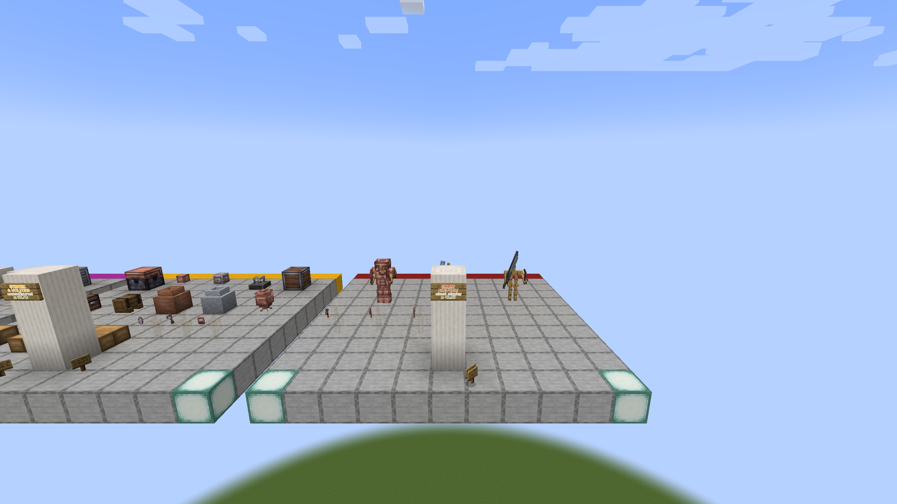

# Combat and equipment

Record Ebony tools and armor, Battle Pickaxe, Broadsword, Tuning Mace, Iron
Shield, relevant enchantments, attack/block poses, damage rules, durability,
and equipment-slot integration.

Use fixed attacker/target stats and record equipment, action, damage/durability
before and after, cooldown, animation, and screenshot filenames. Armor stands
in the gallery validate appearance only.

The port passes this area when attributes, shield behavior, Curios/Trinkets
equivalents where applicable, synchronization, and visuals agree across
loaders.

## Static reference capture

- Reference JAR: `Etherology-1.21-0.1.7.jar`
- Captured: `2026-08-31 00:29:49` Europe/Madrid
- Fixture viewpoint: spectator at `53.5 101 18.5`
- Framebuffer: `2560x1440`
- SHA-256: `0c4207d675bf6428847cca3f70f684e79a28b9481a9616e30cd2c9b337057797`

This capture records armor, weapon, and shield presentation on fixtures. It is
not evidence of combat values, blocking, durability, or slot integration.

## Forge 1.20.1 port runtime proof

The current cumulative Forge port evidence is the headless dedicated-server
[`enchantment-registry-server-v7`](../../../../evidence/forge-1.20.1/enchantment-registry-server-v7)
archive. Report schema 5 passed 95 of 95 assertions. Common owns exactly
`etherology:peal` and `etherology:reflection` through
`ru.feytox.etherology.registry.misc.PealEnchantment` and
`ru.feytox.etherology.registry.misc.ReflectionEnchantment`. Peal has maximum
level 3, minimum powers `1, 12, 23`, and maximum powers `21, 32, 43`;
Reflection has maximum level 1, minimum power `1`, and maximum power `21`. They
are the only Etherology enchantment IDs, both belong to the singular
`minecraft:non_treasure` tag, and their identities, classes, properties, and
tag membership remained stable at server start and through a real reload. The
server saved and stopped normally, exited with code zero, and produced no fatal
or client-only marker.

This is port-runtime registry evidence, not an original 1.21.1 or client-side
mechanic capture. It does not prove item applicability, Peal's shockwave,
projectile reflection, client visuals, or screenshots. Those original/client
interactions remain uncaptured here, so this evidence does not satisfy the
combat-equipment scenario or establish release readiness. The v6 Ether-source
archive is retained as historical evidence; v7 is the current cumulative
dedicated-server proof.
