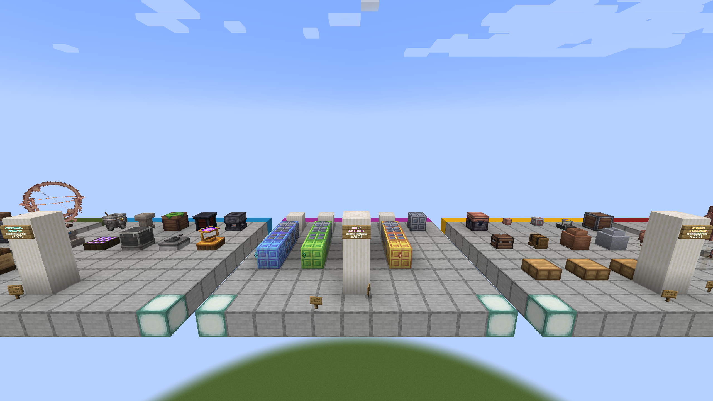

# Divine seals and aspects

Record all four seals, their deterministic orientation and scale, discovery
through the Oculus, sedimentary stages, Primoshard extraction, and representative
derived-aspect presentation.

The visual gallery supplies static comparisons only. Mechanical evidence must
also show the configured seal state, triggering action, extracted result, and
state after save/reload.

The port passes this area when IDs and serialized state remain compatible and
Fabric/Forge produce equivalent discovery, extraction, particles, and renders.

## Static reference capture

- Reference JAR: `Etherology-1.21-0.1.7.jar`
- Captured: `2026-08-31 00:29:41` Europe/Madrid
- Fixture viewpoint: spectator at `29.5 101 18.5`
- Framebuffer: `2560x1440`
- SHA-256: `358af0ff52712f6dbcb92a3b8b34b67007d8201ab19ec02335a185d3857fcdf0`

This capture records the staged seal and aspect presentation only. Discovery,
extraction, serialized state, particles, and reload behavior remain open E2E
checks.
