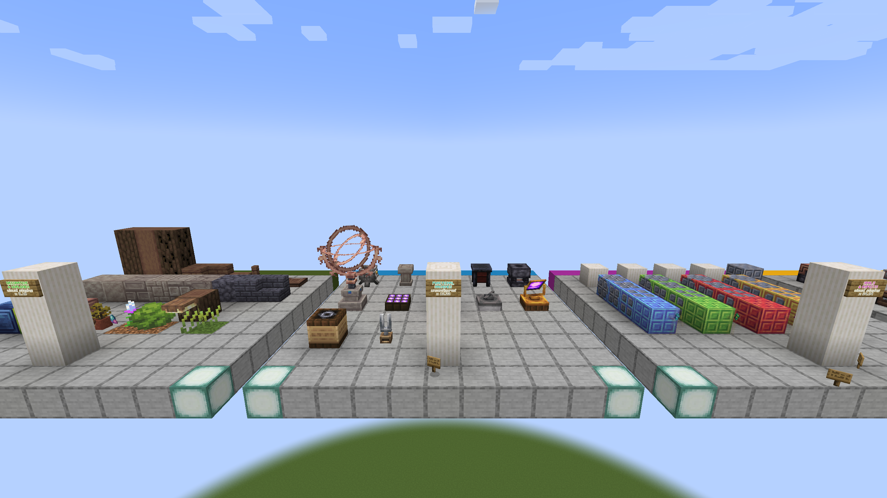
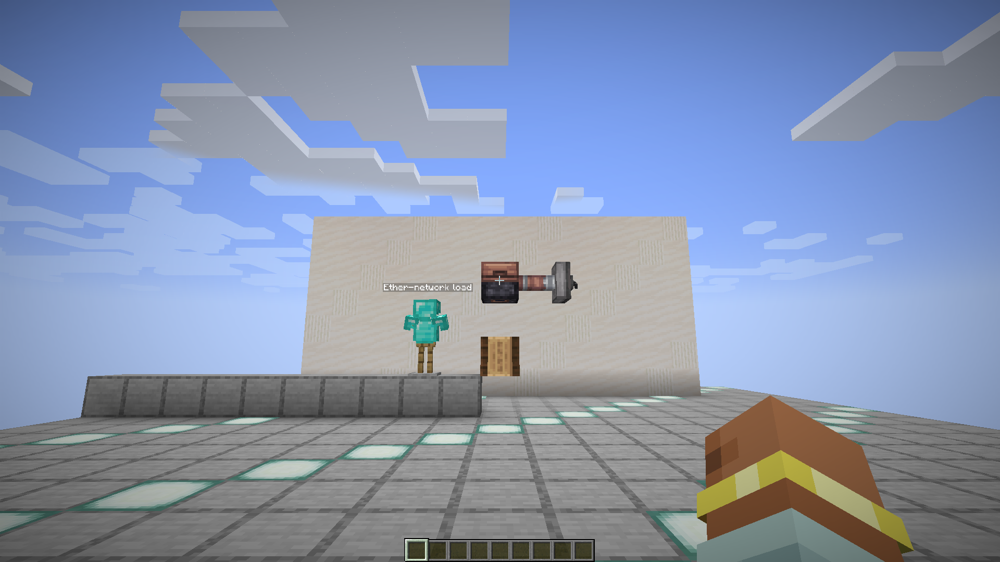
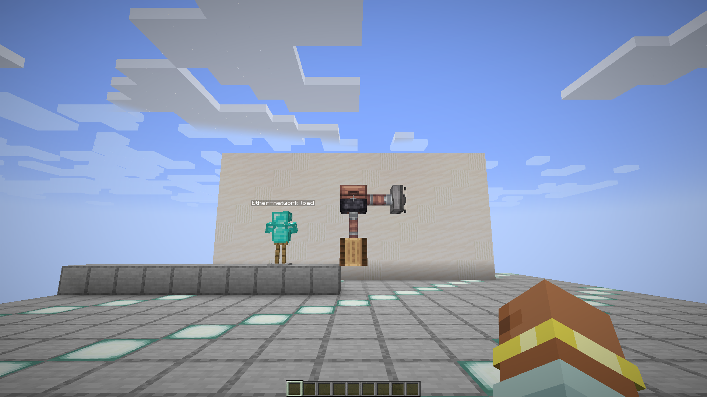
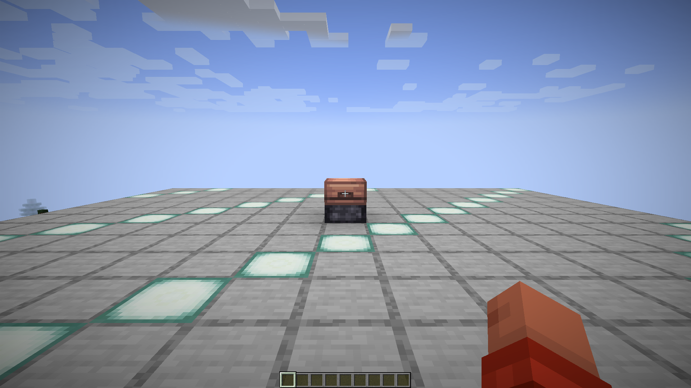
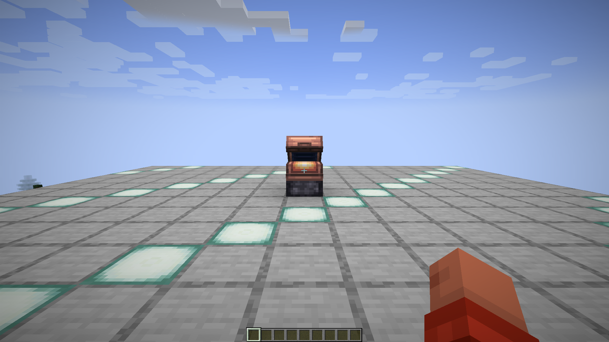
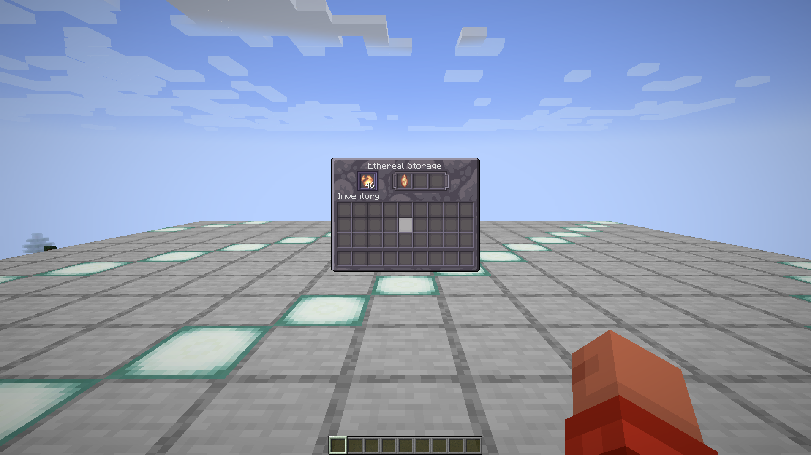
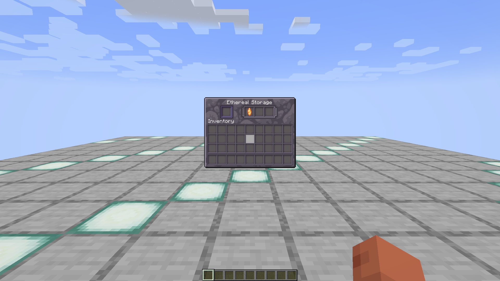
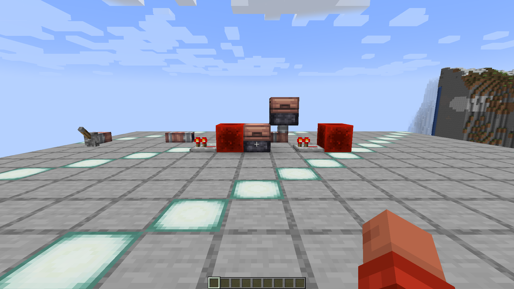
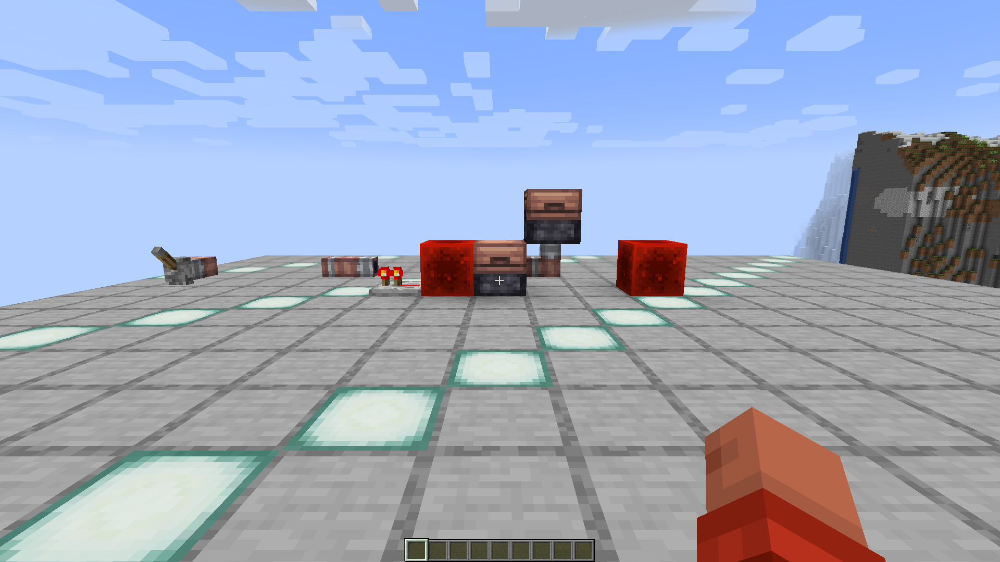

# Ether network and machines

Record channels, forks, sockets, storage, Glints, Ethereal Furnace, Spinner,
Metronome, Levitator, generators, and transfer direction/state.

Use deterministic layouts with labeled sources and sinks. Record stored Ether,
transfer rate, tick count, block-entity state, visible animation, and results
after unload/reload. The visual gallery intentionally leaves machines
unconfigured.

The port passes this area when topology, capacity, processing, synchronization,
and persistence are equivalent on Fabric and Forge.

## Static reference capture

- Reference JAR: `Etherology-1.21-0.1.7.jar`
- Captured: `2026-08-31 00:29:38` Europe/Madrid
- Fixture viewpoint: spectator at `17.5 101 18.5`
- Framebuffer: `2560x1440`
- SHA-256: `688885fec738f737310c115270bd4c2e955144066a86df14f56c06d1e974f9d3`

This capture records the unconfigured machine and channel presentation. It is
not evidence of transfer, processing, synchronization, or persistence.

## Native original phase-zero capture

The 2026-08-31 `published-0.1.7` run proves that the Ethereal Storage at the
left of the frame and its exact block-entity type were present on the server,
mirrored on the client, rendered for 120 ready frames, and included in a forced
world save. Inventory and transfer behavior remain separate acceptance work.

## Fabric 1.20.1 interaction record

The isolated `etherology-e2e-fabric-1.20.1-v19` client completed the
`ether-network` scenario with 46 passing assertions and no failures. The real
integrated-world fixture verifies:

- four counted Spinner generations and directional channel transfer;
- the first Ether unit becoming 100 ticks of Levitator fuel;
- a visible armor stand moving `0.7676404465781816` blocks on the force track;
- the redstone gate closing before later Ether is retained;
- final Ether distribution of one unit each in the Levitator, output channel,
  and Ethereal Storage;
- five block-entity NBT reconstructions, client mirroring, and a forced save.

The complete assertion inventory, bounded state history, and artifact
provenance are stored in
[`report.json`](../../../../evidence/fabric-1.20.1/ether-network-v19/reports/report.json).
The deterministic verifier measured a changed-pixel ratio of `0.432843` between
the two native 1920x1080 Minecraft framebuffers.

## Forge 1.20.1 Ethereal Storage record

The isolated `etherology-e2e-forge-1.20.1-v7` client completed the bounded
`ethereal-storage` scenario with 34 passing assertions and no failures. Its real
integrated-world fixture verifies:

- one four-slot Ethereal Storage block entity reconstructed from NBT;
- Forge `ITEM_HANDLER` access on the unsided view and all six faces, including
  simulated and live Glint insertion, blocked extraction, and the hidden display
  slot;
- transfer from 64 internal Ether plus a 64-Ether Glint while preserving 128
  total Ether;
- viewer open/close calls and the synchronized Gecko open/close animation;
- the native menu before save and after a complete integrated-world restart;
- exact Ether distribution, ordered input inventory, display state, and
  block-entity type retained across forced save, disconnect, and restart.

The complete assertion inventory and artifact provenance are stored in
[`report.json`](../../../../evidence/forge-1.20.1/ethereal-storage-v7/reports/report.json).
The deterministic verifier measured `0.253670` changed pixels in the centered
storage region from closed to open and only `0.001168` from the original closed
frame to the closed-again frame. These captures and assertions accept only the
bounded storage vertical. The channel record below is an independent bounded
vertical; neither record establishes parity for the wider Ether network or
opens the Forge release gate.

## Forge 1.20.1 Ethereal Channel foundation record

The fresh isolated `etherology-e2e-forge-1.20.1-v11` client completed the
bounded `ethereal-channel` scenario with 42 passing assertions and no failures.
Its real integrated-world fixture verifies:

- registered channel and storage endpoints with exact persistent Ether,
  activation, direction, and block-entity state;
- a powered redstone gate retaining one Ether in the channel, followed by
  exact transfer into storage on the fifth-tick cadence after power removal;
- an independent missing-output channel evaporating exactly `0.2` Ether on its
  fifth-tick cadence and naturally clearing its evaporation flags;
- a vanilla wall lever remaining attached to the channel, preserving its
  support and connection topology, and surviving restart through native Forge
  support;
- exact client mirrors, ready terrain, and the fixed first-person camera for
  120 consecutive composed frames before each capture;
- exact state and block-entity types after force-save, disconnect, and a full
  integrated-world restart.

The complete assertion inventory and artifact provenance are stored in
[`report.json`](../../../../evidence/forge-1.20.1/ethereal-channel-v11/reports/report.json).
The deterministic verifier measured a `0.013136` gated-to-transferred change
and `0.004009` transferred-to-reopened structural change across the three
native `1920x1080` Minecraft framebuffers.

This evidence accepts only the shared channel foundation, its bounded network
behavior with storage endpoints, and native Forge lever support. Channel case
interaction and registration, particles and the client ticker, channel loot
and recipe data, and the wider machine/network graph remain deferred. The next
forward gate is the remainder of the authoritative registry spine; Forge release
readiness remains closed.

## Forge 1.20.1 Ether-source reload record

The fresh repository-owned
`etherology-e2e-forge-server-1.20.1-v6` profile completed the bounded
`ether-source-reload` scenario on a real Java 17 Forge 47.4.9 dedicated server.
Its schema-4 report passed all 72 assertions. Common is the sole implementation
and resource owner for the Ether-source server-data listener and its default
data. The initial map contained exactly 23 entries, including corrected
`etherology:primoshard_rella = 4` and `minecraft:redstone = 2`. The probe then
issued the real `reload` command with an isolated override/addition pack. The
reloaded map contained exactly 24 entries with `minecraft:redstone = 9.5` and
added `minecraft:diamond = 13`.

The game-event registry and exact listening tags remained stable across the
reload. The loot-condition registry and evaluated behavior also remained
stable while Minecraft correctly replaced the probe `LootTable` instance. The
world was saved, the server stopped normally, and the launcher exited with code
zero; the copied server log contains no `ERROR` or `FATAL` marker. This is a
headless dedicated-server data proof, so there are no screenshots to add to the
visual gallery.

The complete assertion inventory is stored in
[`report.json`](../../../../evidence/forge-1.20.1/ether-source-reload-server-v6/reports/report.json).
The immutable archive binds profile-manifest SHA-256
`2e6b937169d7bf8d765d181de93837371fb32940b31a480f5fde9620d96d21f0`,
server-log SHA-256
`0be91a9c231e12d00066a2924ba755820da0a8be9f3ef654bb243a375ee5628f`,
and archive-manifest SHA-256
`6d552536f74c018ce56e238fcb5a3aacd8fa363c76293863514adf9d7bafc2e0`.

This record accepts only Common listener/default-data ownership and the bounded
reload behavior above. It does not prove Ethereal Furnace or other machine
consumption, the wider Ether network, the full authoritative registry, native
sound playback, Forge custom sculk frequency, Attrahite drops, or release
readiness. The v6 archive remains immutable historical evidence; the cumulative
v7 enchantment-registry server record re-proves these Ether-source assertions
and is now the current dedicated-server proof.
