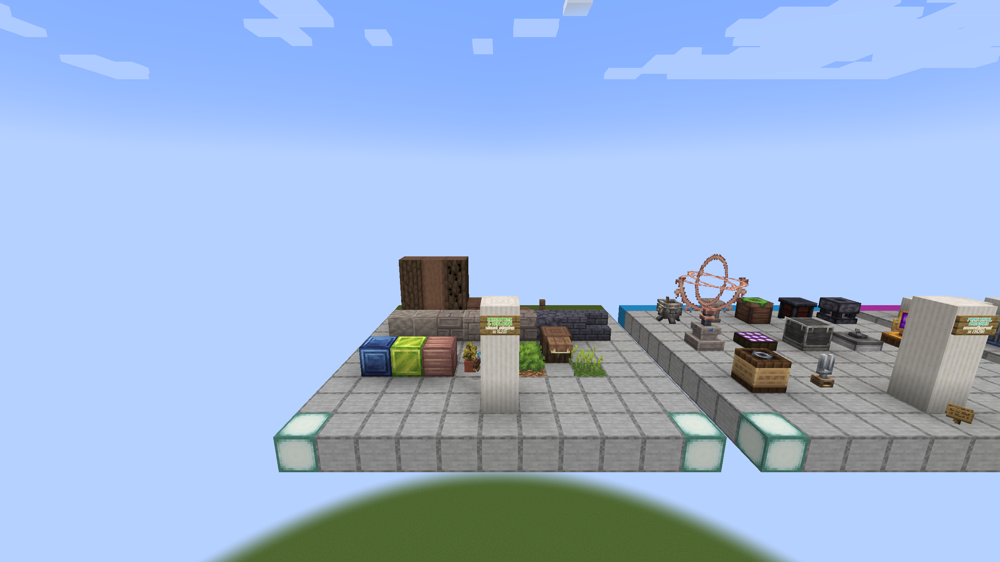

# Golden Forest

Record biome location, terrain transition, Peach and weeping Peach trees,
Thuja, Beamer, Forest Lantern, Lightelet, and Ether Monolith presentation.

Each capture must include the world seed or deterministic fixture, coordinates,
weather/time, render distance, and screenshot filename. Static gallery blocks
do not prove biome placement or feature generation.

The port passes this area when a fixed seed produces the expected biome and
structures on each loader without broken block states, missing models, or
materially different placement.

## Static reference capture

- Reference JAR: `Etherology-1.21-0.1.7.jar`
- Captured: `2026-08-31 00:29:34` Europe/Madrid
- Fixture viewpoint: spectator at `5.5 101 18.5`
- Framebuffer: `2560x1440`
- SHA-256: `4d4849e9c3551970deb8e1714ace3b4f85aa2b4898ca0c8feb6d8ae39c84f295`

This capture records the decorative/world-generation palette staged by the
gallery. It is not evidence that Golden Forest biome placement succeeds.
