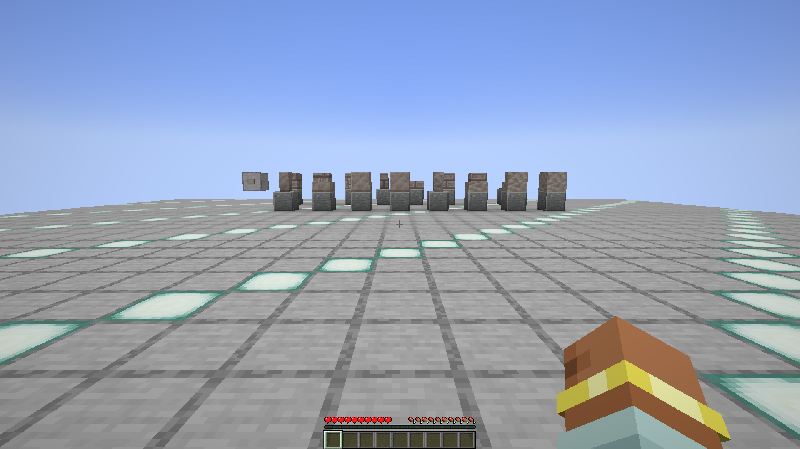

# Materials and building blocks

Record Etherology's raw materials, processed materials, decorative block
families, mining requirements, recipes, loot behavior, rendering, and saved
block states. Each accepted slice must bind observations to the published
`0.1.7` binary before the same contract is exercised on every ported loader.

## Attrahite block family

- Reference: published `Etherology-1.21-0.1.7.jar`
- Captured: `2026-09-01 01:56` Europe/Madrid
- World seed: `4995697332085600305`
- Fixture: deterministic integrated-world four-block gallery
- Framebuffer: `1920x1080`, after 120 consecutive ready renders
- Screenshot SHA-256:
  `61a405e33b09c2d55c117776c8c1f1bae8906be14f8104b676553e85eb97ab09`

The unedited framebuffer shows Attrahite bricks, brick slab, brick stairs, and
raw Attrahite arranged on the lit comparison platform. The accompanying
49-assertion runtime report proves the four block and item registrations,
runtime classes, default states, state counts and network IDs, block/item tag
memberships, all nine recipes, all four loot tables, Silk Touch behavior, the
seeded plain-tool and Fortune III raw-ore outcomes, and a forced persistent
world save.

The gallery is a rendering and placement reference. It does not prove natural
ore generation, progression balance, or mining-time balance. Those require
their own deterministic scenarios.

The complete immutable capture is stored in
[`docs/evidence/original-1.21.1/attrahite-block-registry-v4`](../../../../evidence/original-1.21.1/attrahite-block-registry-v4).

## Slitherite block family

- Reference: published `Etherology-1.21-0.1.7.jar`
- Captured: `2026-09-04 08:35` Europe/Madrid
- World seed: `4995697409260082224`
- Fixture: deterministic integrated-world 17-block gallery
- Framebuffer: `1920x1080`, after 120 consecutive ready renders
- Initial screenshot SHA-256:
  `57c867a7591b0593a17c71091c0d27b2d16720350623d4c5a71fc56298ad4872`
- Reopened screenshot SHA-256:
  `450fc61f3bd9d385229cfa4dfb645b49c56660b5c17a600a6b7946402b7c9053`

The unedited framebuffer shows raw, polished, brick, chiseled, and cracked
Slitherite together with the registered stairs, slabs, walls, button, and
pressure plate. The 185-assertion report proves the ordered block/item
registrations, exact runtime classes and default states, 1,262 state network
IDs, 79 Etherology visual assets plus a vanilla sentinel, exact tags, 17 loot
tables, 29 owned recipes and advancements, and five related recipes recorded
without claiming ownership. Every gallery member was placed through its real
`BlockItem` path.

The same native run proves the polished button powers, schedules its reset, and
returns unpowered after 27 ticks. An item does not power the polished pressure
plate, an ordinary living entity does, and the plate resets naturally. The
fixture was force-saved, disconnected, reopened, and found structurally and
data-exact before the second capture. Both screenshots passed the bounded
visual comparison with a `0.001390` materially changed-pixel ratio and
`6.280167` mean maximum-channel delta.

The gallery does not establish natural Slitherite generation, mining speed, or
progression balance. The complete immutable capture is stored in
[`docs/evidence/original-1.21.1/slitherite-block-registry-v10`](../../../../evidence/original-1.21.1/slitherite-block-registry-v10).
