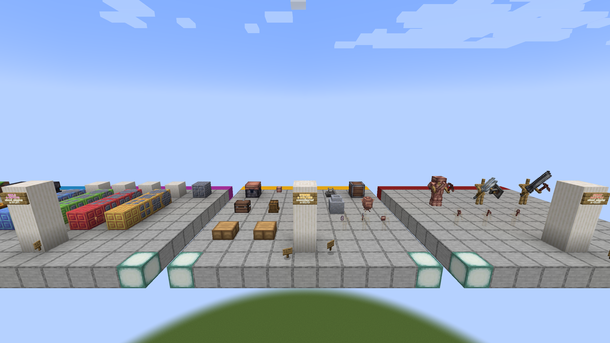
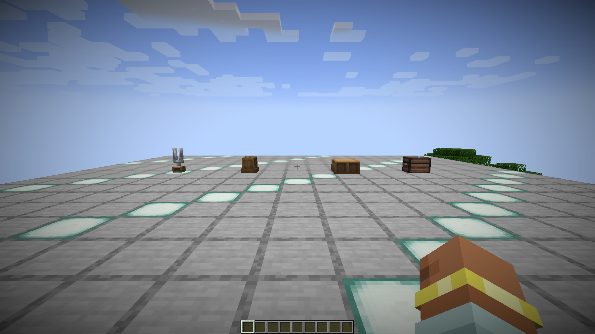
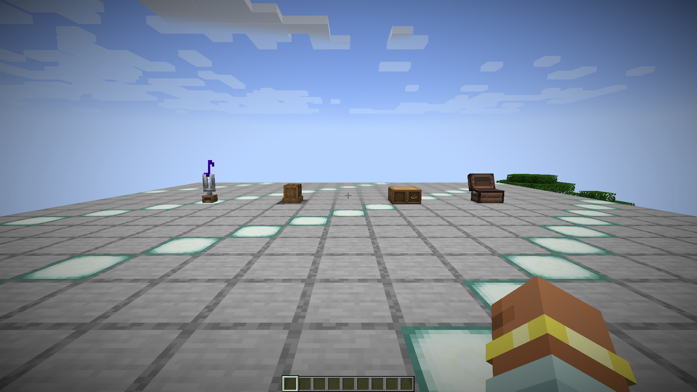

# Storage, furniture, and utilities

Record Crates, Closets, Shelves, furniture slabs, Jugs, Spill Barrels, Samovar,
Tuning Fork, Stream Key, Warp Counter, and directional/combined block states.

Capture closed/open or empty/full states, inventories and fluids, interaction,
neighbor changes, break/re-place behavior, and screenshot filenames. Static
gallery placement is only a model/block-state comparison.

The port passes this area when inventories, fluids, shapes, drops, models, and
serialized state remain equivalent.

## Static reference capture

- Reference JAR: `Etherology-1.21-0.1.7.jar`
- Captured: `2026-08-31 00:29:45` Europe/Madrid
- Fixture viewpoint: spectator at `41.5 101 18.5`
- Framebuffer: `2560x1440`
- SHA-256: `63fc6a1312eeae674397aa292681c6c5fed672d2551eba59b2d8b259b696648b`

This capture records static model, texture, and block-state presentation.
Inventories, fluids, interaction, neighbor updates, and reload behavior are
covered by the Fabric 1.20.1 port evidence below for the implemented fixture.

## Fabric 1.20.1 interaction record

The isolated `etherology-e2e-fabric-1.20.1-v13` client completed the
`storage-utilities` scenario with 42 passing assertions and no failures. The
fixture uses real block interactions and verifies:

- a server-owned Crate screen and five retained diamonds;
- three Books inserted into a Shelf through block use;
- a survival-mode healing-potion exchange with the returned Glass Bottle;
- the Spill Barrel's neighbor-driven `with_frame` transition;
- twelve accepted Tuning Fork uses and the persisted note/delay state;
- four block-entity NBT reconstructions, client mirrors, and a forced world save.

The complete assertion inventory and artifact provenance are stored in
[`report.json`](../../../../evidence/fabric-1.20.1/storage-utilities/reports/report.json).
The deterministic verifier measured a changed-pixel ratio of `0.100598` between
the two native 1920x1080 Minecraft framebuffers.
