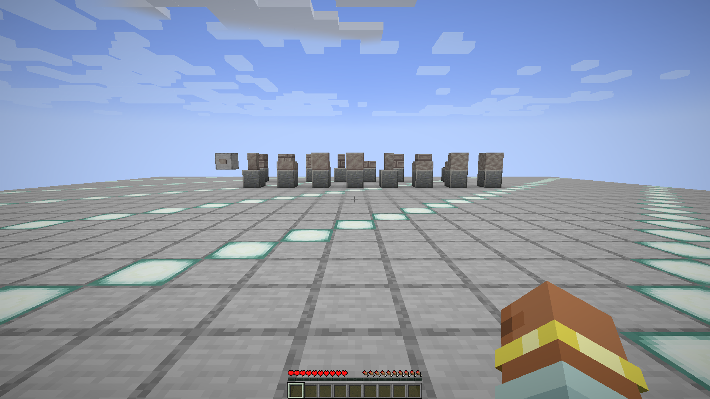
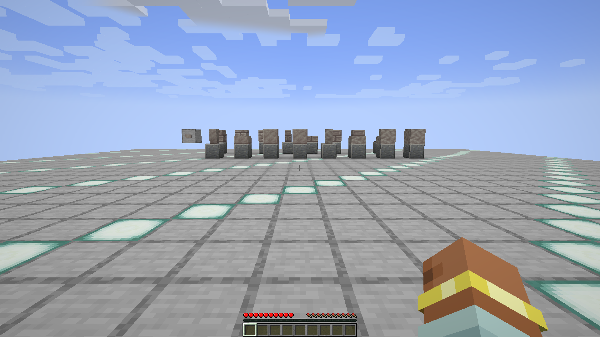
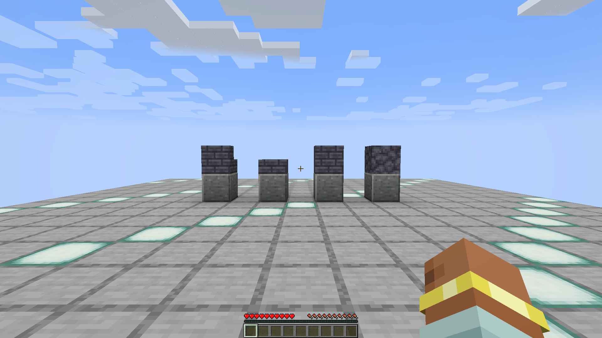

# Fabric 1.20.1 runtime evidence

This directory contains frozen evidence captured from real Minecraft clients on
the baseline Mac. Every run uses a new repository-owned profile under
`scripts/e2e/.state/`; no external launcher profile is read, modified, or used as
a source.

## Current Slitherite block-registry proof (v31)

The one-shot `etherology-e2e-fabric-1.20.1-v31` profile ran the packaged
`slitherite-block-registry` scenario in a fresh repository-owned runtime and
integrated world. The report passed all 185 ordered assertions in 1,128 client
ticks, force-saved, disconnected, reopened the same world, and shut down
normally. Provisioning and launch consulted no external game profile.





- Profile manifest: `7,086` bytes, SHA-256
  `924f1290991514e341f2bb176a85239a773ddc67ca6daa880ffa8876b7708e14`
- Minecraft: `1.20.1`; Fabric Loader: `0.17.3`; runtime Java: `17`
- Production JAR SHA-256:
  `1b1a5a5e80f4ff48c9110c286bd88e5f81d4a69d6c735a5648733f2af99bcd79`
- Harness JAR SHA-256:
  `8f702fe349f14bc8f1824fb0937b27bf3ea40a2b94a32da559390922a13905d0`
- Report status: `passed`; assertions: `185` passed, `0` failed
- Screenshots: `2` unedited native composed Minecraft framebuffers,
  `1920x1080`, each after 120 stable completed renders
- Reopened material changed-pixel ratio: `0.072453`

The verifier proves the exact 17 block and `BlockItem` registrations, 1,262
unique non-negative block-state network IDs, 79 Slitherite visual resources,
11 block/item tags, 17 loot tables, 29 owned recipes and their 29
advancements, and the five related recipes recorded but not owned by the
Slitherite family. It also proves real `BlockItem` placement for all 17 blocks,
the button's scheduled powered/reset cycle, item rejection and living-entity
activation/reset for the pressure plate, exact client/server fixture mirrors,
and structural and data equality after the full save/disconnect/reopen
lifecycle.

Frozen file digests:

- `slitherite-block-registry-v31/archive-manifest.json`:
  `12c12e1d2772ae2a449a2c140e6af77e32f1f8eefb35aec06718eead1a4140c5`
- `slitherite-block-registry-v31/reports/report.json`:
  `e7648183de3bafb8da9c1f31466e78868077b43304af93b16902f10f9bc74e44`
- `slitherite-block-registry-v31/reports/done.marker`:
  `37a40f08d8548dba289b9b0bb35bcf63b359f6d37ee86044ebc6b6da080b9ec1`
- `slitherite-block-registry-v31/screenshots/slitherite-block-registry-initial.png`:
  `7f51f94f7564faecffb4b45fcdcbc53b23e0afcc09ee02f016d1f1e361cf8c09`
- `slitherite-block-registry-v31/screenshots/slitherite-block-registry-reopened.png`:
  `0dc45779791d6f3eb48af93830b57f510953184780df857289dc3843d0ee957f`

Repeat the archive-only check with:

```bash
python3 -B scripts/e2e/fabric_slitherite_evidence_v31.py \
  --archive docs/evidence/fabric-1.20.1/slitherite-block-registry-v31
```

This is a bounded Slitherite-family registration, resource, data, interaction,
rendering, and persistence proof. It does not establish natural generation or
release readiness. The v31 profile is permanently consumed and must never be
provisioned, staged, checked, or launched again. The
[Forge packaged-client v19 counterpart](../forge-1.20.1/slitherite-block-registry-v19/)
is now accepted with all 185 assertions, including the complete five-related-recipe
contract and its real pedestal, alchemy, and lens dependencies. Only the
[Forge dedicated-server v21 counterpart](../forge-1.20.1/README.md) remains
prepared and pending; the rejected, consumed v20 server attempt is diagnostic
history, not acceptance.

## Current Attrahite block-registry proof (v30)

The one-shot `etherology-e2e-fabric-1.20.1-v30` profile ran the packaged
`attrahite-block-registry` scenario in a fresh integrated world. The report
passed all 91 assertions in 586 client ticks, force-saved, disconnected,
reopened the world, and published two unedited native 1920x1080 composed
framebuffers. Provisioning and launch consulted no external game profile.



- Profile manifest: `7,051` bytes, SHA-256
  `f2131cb9190b17b42035604d26988a1aa8091cbc94541cb29c0e9d018bcf8000`
- Minecraft: `1.20.1`; Fabric Loader: `0.17.3`; runtime Java: `17`
- Production JAR SHA-256:
  `f370e0c91de3ef7439fe18c673ccf336708c99231e252bdec289f768840f18b1`
- Harness JAR SHA-256:
  `1c978b594d0f6d92355b1d588993cc979e47f4fb39548213c7ac17ed813d267a`
- Report status: `passed`; assertions: `91` passed, `0` failed
- Reopened changed-pixel ratio: `0.021750`

The verifier proves the exact four block/item registrations, runtime classes,
default states, valid unique non-negative default-state network IDs, canonical
resources, block/item tags, four loot tables, nine recipes and advancements,
native `BlockItem` placement, plain, Silk Touch, and seeded Fortune III loot,
and exact structural/data persistence after reopen. Before the first fixture
mutation, 20 consecutive client ticks proved all four arena chunks loaded, an
empty update queue, an idle lighting provider, all four light columns enabled,
and all six future SKY samples at 15.

Frozen file digests:

- `attrahite-block-registry-v30/archive-manifest.json`:
  `430971b61511f2fdb94f0855c13b9a28bf4f8bb79432a084abfae659e6859732`
- `attrahite-block-registry-v30/reports/report.json`:
  `db5f6d7af11f1406c304b8ec64aa3022a25f774f8704fde4a70cc9fc31faebb5`
- `attrahite-block-registry-v30/reports/done.marker`:
  `37a40f08d8548dba289b9b0bb35bcf63b359f6d37ee86044ebc6b6da080b9ec1`
- `attrahite-block-registry-v30/screenshots/attrahite-block-registry-initial.png`:
  `3b0e9c87f794886835879db2f54091e74632f316d9905bd1418116074055adca`
- `attrahite-block-registry-v30/screenshots/attrahite-block-registry-reopened.png`:
  `7041da05fe40d27ffedcc21e848c477b8b173e61561f4bceeb53ad284a2f4e2f`

Repeat the archive-only check with:

```bash
python3 -B scripts/e2e/fabric_attrahite_evidence_v30.py \
  --archive docs/evidence/fabric-1.20.1/attrahite-block-registry-v30
```

This is a bounded block-family, loot, recipe, rendering, and persistence proof;
it does not establish natural Attrahite generation. The v30 identity is
permanently consumed and must not be provisioned, staged, checked, or launched
again.

## Current Forest Lantern visual proof (v24)

The one-shot `etherology-e2e-fabric-1.20.1-v24` profile ran the packaged
`forest-lantern` scenario in a fresh integrated world. The fixture records an
empty support matrix, all twenty age/facing states, four cumulative real
`BlockItem` placements, and the complete matrix after save, disconnect, and
reopen. Every capture follows 120 consecutive exact mirror, terrain-ready, and
fixed-camera renders. All seven PNGs are unedited native composed Minecraft
framebuffers at `1920x1080`.

- Profile: `etherology-e2e-fabric-1.20.1-v24`
- Profile manifest: `7017` bytes, SHA-256
  `77b9d33689d76e7b46d849f519337821744a81e3dd287bd4a1339a7c6a801a77`
- Minecraft: `1.20.1`; Fabric Loader: `0.17.3`; runtime Java: `17`
- Production JAR SHA-256:
  `982f16bf04a99c416efd25406df167e3539faede5f8f1024f0269221916725a1`
- Harness JAR SHA-256:
  `38bfa390cb0e9a7409f2dce23a938cc96ce97a3ad9c201a5ab418c36e3e9e52a`
- Report status: `passed`; assertions: `68` passed, `0` failed
- Client ticks: `650`; screenshots: `7`
- Minimum placement-transition changed-pixel ratio: `0.008737`

The verifier proves exact registry and resource inventories, cutout rendering,
baked non-empty models, luminance 8, twenty unique non-negative state network
IDs, all sixteen forced immature states, rejection of the unsupported
placement, and four consumed-stack mature placements in north/east/south/west
order. The complete server/client matrix and placement evidence persist after
reopen. Visual inspection confirms the five growth models render with their
transparent glowing textures against every support orientation, no
missing-texture magenta is present, each cumulative facing appears in the
expected capture, and the reopened scene matches the final state.

Frozen file digests:

- `forest-lantern-v24/archive-manifest.json`:
  `8b09e5e4094d6e23004721641acce30f3590afaf9337ac7f7e00180a82d9a0a8`
- `forest-lantern-v24/reports/report.json`:
  `6d0a70a2617d5008e39c0a72664e01f200e7899baf082f14db19d509c0632204`
- `forest-lantern-v24/reports/done.marker`:
  `37a40f08d8548dba289b9b0bb35bcf63b359f6d37ee86044ebc6b6da080b9ec1`
- `forest-lantern-v24/screenshots/forest-lantern-empty.png`:
  `a75a836b77a46fcf6e233ccfa360c45e257cdf03940a8e96c2ea453a6f515235`
- `forest-lantern-v24/screenshots/forest-lantern-stages.png`:
  `b315fb454aed667ec7bd41e1714dfab100a6146dc5840cfbbec3a6de530953cd`
- `forest-lantern-v24/screenshots/forest-lantern-facing-north.png`:
  `c8bd9bd859873f907bda051b0b60f2f1031880db17c805007e853e294f098fb6`
- `forest-lantern-v24/screenshots/forest-lantern-facing-east.png`:
  `6dbc6c0932d862786b8e1afdf62428850399b83ec3af07850a3c4b9146ccd00c`
- `forest-lantern-v24/screenshots/forest-lantern-facing-south.png`:
  `2c32ec1943ee4848ca046aeea87dc1b8304919e096977a2ce02d371f2a9c13af`
- `forest-lantern-v24/screenshots/forest-lantern-facing-west.png`:
  `5b200ae96fd6004729c246dcf3603186be2575b7a62d60a967d7d8ddafebdbc9`
- `forest-lantern-v24/screenshots/forest-lantern-reopened.png`:
  `91737c2423268cb682794492973ee622c936929e30c5007efef7dee17eeb8586`

Repeat the archive-only check with:

```bash
python3 -B scripts/e2e/fabric_forest_lantern_evidence.py \
  --archive docs/evidence/fabric-1.20.1/forest-lantern-v24
```

This accepts the bounded Fabric visual and persistence vertical only. Natural
growth on peach logs, bonemeal spreading, jump/mining/loot/recipe execution,
multiplayer, the wider Golden Forest graph, and release readiness remain
outside this client capture. The v24 identity is consumed and must not be used
for another lifecycle action.

## Historical metal-block-registry visual proof (v23)

The fresh repository-owned `etherology-e2e-fabric-1.20.1-v23` profile ran the
dedicated `metal-block-registry` scenario against the packaged Fabric artifact.
In one integrated Survival world, the harness first captured three empty
polished-andesite pedestals, placed `etherology:azel_block`,
`etherology:ethril_block`, and `etherology:ebony_block` directly on the server
thread, waited for the exact client mirror, and captured the populated fixture
from the same fixed first-person camera. Each capture followed 120 consecutive
render-ready, fixture-exact frames. Both PNGs are unedited native composed
Minecraft framebuffers at `1920x1080`; their changed-pixel ratio is `0.087510`.

- Profile: `etherology-e2e-fabric-1.20.1-v23`
- Profile manifest SHA-256:
  `36e7ccb7556aaaf0edb01b066de6d5263f3dde3545ac016e84cf07f795403f84`
- Profile manifest size: `6993` bytes
- Production JAR SHA-256:
  `5da646a56d326b5ad5492e5ba936758f3c7723f73d6be314cd79d6881fedc1dd`
- Harness JAR SHA-256:
  `0cc892f41399eec903af57c3270f19db027b0e7611e392a0fc817876e373b111`
- Report status: `passed`
- Assertions: `25` passed, `0` failed
- Client ticks: `1680`
- Stable completed renders: `120` before and `120` after placement
- Screenshot pair: native composed Minecraft framebuffers, `1920x1080`
- Changed-pixel ratio: `0.087510`

The exact ordered assertion inventory is:

1. `fabric_mod_loaded:etherology`
2. `registry:block:etherology:azel_block`
3. `registry:block:etherology:ethril_block`
4. `registry:block:etherology:ebony_block`
5. `default_state_network_ids`
6. `client_render_resources`
7. `packaged_root_jar:etherology`
8. `packaged_root_jar:etherology_e2e_harness`
9. `integrated_world_joined`
10. `server_arena_chunk_loaded`
11. `before_fixture_exact`
12. `before_capture_render_ready`
13. `before_capture_camera_exact`
14. `before_consecutive_stable_renders`
15. `before_framebuffer_dimensions`
16. `native_screenshot_written:before`
17. `server_fixture_ids_exact`
18. `after_capture_client_fixture_ids_exact`
19. `after_capture_render_ready`
20. `after_capture_camera_exact`
21. `after_consecutive_stable_renders`
22. `after_framebuffer_dimensions`
23. `native_screenshot_written:after`
24. `forced_world_save`
25. `isolated_save_directory_present`

Frozen file digests:

- `metal-block-registry-v23/archive-manifest.json`:
  `69717273eac7b543378aa1a804573e27805e33b771601abba7c49923a5a42f44`
- `metal-block-registry-v23/reports/report.json`:
  `938f0f73c1104d82d9ede1dd3852ee31871f9b9479017811957102209ff54e73`
- `metal-block-registry-v23/reports/done.marker`:
  `37a40f08d8548dba289b9b0bb35bcf63b359f6d37ee86044ebc6b6da080b9ec1`
- `metal-block-registry-v23/screenshots/metal-block-registry-before.png`:
  `445d1482e8ead2b81aaecbd970c9eb9bd557b77666cd0b29fdee98b76d46eadb`
- `metal-block-registry-v23/screenshots/metal-block-registry-after.png`:
  `053679247db8215e604f294efd3817349b08767b68e4ae3efb9ffbb2ca0dcdb4`

The live runtime and immutable archive passed the dedicated verifier:

```text
Validated Fabric metal-block-registry (etherology-e2e-fabric-1.20.1-v23): 25 assertions, 2 screenshots, changed-pixel ratio 0.087510
Production SHA-256: 5da646a56d326b5ad5492e5ba936758f3c7723f73d6be314cd79d6881fedc1dd
Harness SHA-256: 0cc892f41399eec903af57c3270f19db027b0e7611e392a0fc817876e373b111
```

The following commands record the completed one-shot publication shape. Do not
rerun manifest creation because the verifier refuses to replace the existing
manifest. Archive-only validation remains safe:

```bash
python3 -B scripts/e2e/fabric_metal_block_evidence.py \
  --create-archive-manifest docs/evidence/fabric-1.20.1/metal-block-registry-v23 \
  --capture-runtime scripts/e2e/.state/runtimes/etherology-e2e-fabric-1.20.1-v23 \
  --profile-manifest scripts/e2e/fabric-1.20.1-profile.json
python3 -B scripts/e2e/fabric_metal_block_evidence.py \
  --archive docs/evidence/fabric-1.20.1/metal-block-registry-v23
```

The run proves the three exact block registry IDs and non-negative default-state
network IDs, the nine exact client render resources, packaged-root provenance,
integrated-world and chunk readiness, exact server/client fixture states, the
fixed camera and framebuffer contract, native screenshot publication, forced
save, and isolated save directory. It visually records only direct server-side
placement on display pedestals. It does not prove `BlockItem` inventory or
player placement, mining or drops, tool-tier enforcement, beacon activation,
recipe execution, creative-tab placement, restart persistence, multiplayer, or
release readiness. The archive seals capture-time payload and artifact identity;
it does not compare current sources or later rebuilt JARs.

The tracked v23 profile and runtime are consumed and immutable.
`python3 -B scripts/e2e/client.py validate` and the archive-only command above
remain read-only, but no lifecycle action or native launch may use v23 again.
Any next run requires every active profile, runtime, snapshot, test, verifier,
and archive literal to advance to a fresh unused v25-or-newer identity first.

## Phase 0 smoke

- Profile: `etherology-e2e-fabric-1.20.1-v12`
- Minecraft: `1.20.1`
- Fabric Loader: `0.17.3`
- Production JAR SHA-256:
  `06c47e738e5c45b753c67b65bf6ac12abef4b810f1308eeb21c18cbe7961a776`
- Harness JAR SHA-256:
  `473c75d0b1a86cf744d8cd0ebcaac7e77232bbc47a2b5b2b5b74f8348be31c29`
- Report status: `passed`
- Assertions: `42` passed, `0` failed
- Client ticks: `200`
- Changed-pixel ratio (title to world): `0.979585`
- Screenshot: native composed Minecraft framebuffer, `1920x1080`

Frozen file digests:

- `phase0-smoke/reports/report.json`:
  `d84e599ea5fb048ede30d47874874c09fd6ee0dff73e84b66387cc8b2a54fe50`
- `phase0-smoke/reports/done.marker`:
  `37a40f08d8548dba289b9b0bb35bcf63b359f6d37ee86044ebc6b6da080b9ec1`
- `phase0-smoke/screenshots/phase0-smoke-title.png`:
  `b20c49adbc1f21c6f4f3ac53a1a7eef0f0fabe8618bdb98a3399091f1760957d`
- `phase0-smoke/screenshots/phase0-smoke-world.png`:
  `febba7a32d35e8049e065761eb5b3bc168467d99b33a88c2b6d55bd135ddab07`

The machine-readable assertions and artifact provenance are in
`phase0-smoke/reports/report.json`. The run verifies all 88,420 registered
Etherology block states have non-negative network IDs, creates and joins a real
integrated world, arranges a four-machine fixture on the server thread, verifies
the client mirror, round-trips block-entity NBT, and force-saves the isolated
world. Both PNGs are captured from Minecraft's own framebuffer after two completed
renders; neither is an operating-system screenshot or crop.

The frozen runtime passed the deterministic repository verifier:

```text
Validated phase0-smoke: 42 assertions, 2 screenshots, changed-pixel ratio 0.979585
```

That verifier rechecks the schema-2 artifact lock and staged JAR bytes, assertion
inventory, PNG CRCs and decoded dimensions, blank-image probe, visual change,
save directory, crash inventory, fatal log markers, normal shutdown, evidence
size bound, and `done.marker` publication order.

## Storage and utilities

- Profile: `etherology-e2e-fabric-1.20.1-v13`
- Production JAR SHA-256:
  `06c47e738e5c45b753c67b65bf6ac12abef4b810f1308eeb21c18cbe7961a776`
- Harness JAR SHA-256:
  `473c75d0b1a86cf744d8cd0ebcaac7e77232bbc47a2b5b2b5b74f8348be31c29`
- Report status: `passed`
- Assertions: `42` passed, `0` failed
- Client ticks: `201`
- Changed-pixel ratio: `0.100598`
- Screenshot pair: native composed Minecraft framebuffers, `1920x1080`

Frozen file digests:

- `storage-utilities/reports/report.json`:
  `0a8665da2fe012e0762bfa5c14c7ca444acd1bd50d733318baa9acd9790b2472`
- `storage-utilities/reports/done.marker`:
  `37a40f08d8548dba289b9b0bb35bcf63b359f6d37ee86044ebc6b6da080b9ec1`
- `storage-utilities/screenshots/storage-utilities-before.png`:
  `a38e1b539a721d32804351016b8cc34132e76d51a7bca07482c81c75a5c5c23f`
- `storage-utilities/screenshots/storage-utilities-after.png`:
  `bcbbd2f67de2ede5c8315b4f403998f6ffe0b84f6f716db14d448c399d4f9b84`

This run uses real server interactions to exercise the Crate, Shelf, Spill
Barrel, and Tuning Fork, then verifies client mirrors, four block-entity NBT
reconstructions, and the forced world save.

```text
Validated storage-utilities: 42 assertions, 2 screenshots, changed-pixel ratio 0.100598
```

## Ether network and Levitator (v18)

- Profile: `etherology-e2e-fabric-1.20.1-v18`
- Production JAR SHA-256:
  `acc23d2432ff84c54f3732cdcaf57439fcb0b12b5701926b8a7c38d1cf64aee5`
- Harness JAR SHA-256:
  `b5b2542003866351e3e0cb18d5fa1380aa73c460b1ca6a9214b52952bab953ef`
- Report status: `passed`
- Assertions: `46` passed, `0` failed
- Client ticks: `232`
- Changed-pixel ratio: `0.481575`
- Screenshot pair: native composed Minecraft framebuffers, `1920x1080`

Frozen file digests:

- `ether-network/reports/report.json`:
  `237c03e27c17b59472394a846b6cd7eaedf3366117af4b4a8048b6886cc127da`
- `ether-network/reports/done.marker`:
  `37a40f08d8548dba289b9b0bb35bcf63b359f6d37ee86044ebc6b6da080b9ec1`
- `ether-network/screenshots/ether-network-before.png`:
  `e85c5c2d7b8a9cba30ae6f1b47461309c14df16bbf03d61600c3489d8725f1b5`
- `ether-network/screenshots/ether-network-after.png`:
  `681e5d284656e6dd2469fcc0c37284e77df52c22521cf749756db6bd30546d18`

The real integrated-world fixture completes four Spinner generations through
directional channels. Its first unit fuels the Levitator for 100 ticks and
moves a visible armor stand `0.7676404465781816` blocks. After the redstone gate
closes, one unit remains in the Levitator, one in the output channel, and one
in Ethereal Storage. The run also reconstructs five block entities from NBT,
checks the client mirror, and force-saves the retained network.

```text
Validated ether-network: 46 assertions, 2 screenshots, changed-pixel ratio 0.481575
```

## Ether network current-artifact rerun (v19)

The accepted Common storage-core work changed the packaged Fabric JAR bytes, so
the Ether-network scenario was repeated in a new profile instead of reusing or
altering `v18`. The behavior and harness are unchanged; this record binds the
same mechanic proof to the current production artifact.

- Profile: `etherology-e2e-fabric-1.20.1-v19`
- Production JAR SHA-256:
  `c0bc7c54d5d2efd3f9632efc4e047e4694a03e7d0725b3e1ca3ab2517454b3c0`
- Harness JAR SHA-256:
  `b5b2542003866351e3e0cb18d5fa1380aa73c460b1ca6a9214b52952bab953ef`
- Report status: `passed`
- Assertions: `46` passed, `0` failed
- Client ticks: `223`
- Changed-pixel ratio: `0.432843`
- Screenshot pair: native composed Minecraft framebuffers, `1920x1080`

Frozen file digests:

- `ether-network-v19/reports/report.json`:
  `d211329f4ace85d9cb3c276d62343b7788518eaf2b6928cc674f1c7190100fe0`
- `ether-network-v19/reports/done.marker`:
  `37a40f08d8548dba289b9b0bb35bcf63b359f6d37ee86044ebc6b6da080b9ec1`
- `ether-network-v19/screenshots/ether-network-before.png`:
  `5e0293c53a0b6f9f219866512e6a9c3a250509afbd7577fc44f638fbacc9b090`
- `ether-network-v19/screenshots/ether-network-after.png`:
  `dc1bb5f6eab2d42e76f7c1981f9391b02a5090aa7ce4e6ade39466d75a5bf2ec`

The rerun again records four Spinner cycles, 100 initial Levitator fuel ticks,
`0.7676404465781816` blocks of armor-stand displacement, and one final Ether
unit each in the Levitator, output channel, and storage. It passed the same
deterministic verifier:

```text
Validated ether-network: 46 assertions, 2 screenshots, changed-pixel ratio 0.432843
```

## Historical packaged-artifact Phase 0 smoke (v22)

The accepted metal-block checkpoint changed the packaged Fabric JAR, so the
baseline scenario ran in another new repository-owned profile. It reached the
resource-loaded title screen, created and joined an integrated world, mirrored
the existing four-machine fixture, force-saved the world, and shut down
normally. Both screenshots are native composed Minecraft framebuffers.

This is bounded capture-time evidence for packaged-artifact startup and
rendering, integrated-world entry, the machine fixture mirror, save, and normal
shutdown. The world fixture contains the Brewing Cauldron, Empowerment Table,
Ethereal Storage, and Armillary Sphere. It does not show or directly interact
with `azel_block`, `ethril_block`, or `ebony_block`. It also does not prove the
material items or food, mining/drop behavior, beacon activation, recipes,
creative-tab behavior, or any other unexercised gameplay mechanic. Exact
current metal declarations and resources are checked separately by the static
artifact gates.

- Profile: `etherology-e2e-fabric-1.20.1-v22`
- Profile manifest SHA-256:
  `289eb0c29066990f7ad967b4f141d08bd7823c0cb79bded85faa37907bd1328f`
- Profile manifest size: `6963` bytes
- Production JAR SHA-256:
  `5da646a56d326b5ad5492e5ba936758f3c7723f73d6be314cd79d6881fedc1dd`
- Harness JAR SHA-256:
  `b5b2542003866351e3e0cb18d5fa1380aa73c460b1ca6a9214b52952bab953ef`
- Report status: `passed`
- Assertions: `42` passed, `0` failed
- Client ticks: `235`
- Changed-pixel ratio (title to world): `0.9796228780864198`
- Screenshot pair: native composed Minecraft framebuffers, `1920x1080`

Frozen file digests:

- `phase0-smoke-v22/archive-manifest.json`:
  `1f0384073101cd9b6794b6322b941a2fbbfc59bd6210382202bea1b16df3df38`
- `phase0-smoke-v22/reports/report.json`:
  `a6a682db2ad60a5bb59df05a57cad101278def12989dc9cd092df85dc6b484bd`
- `phase0-smoke-v22/reports/done.marker`:
  `37a40f08d8548dba289b9b0bb35bcf63b359f6d37ee86044ebc6b6da080b9ec1`
- `phase0-smoke-v22/screenshots/phase0-smoke-title.png`:
  `477bd8dc990c9b0c8b885cdd815a6143aebefd15a72fa76a59044c372495f264`
- `phase0-smoke-v22/screenshots/phase0-smoke-world.png`:
  `e2eb9f9d1e8f747d4ddc5d343cf0d5bb9ac63adf02f0b6d49a917f8c4275eb97`

The live runtime and immutable archive passed the deterministic verifier:

```text
Validated phase0-smoke: 42 assertions, 2 screenshots, changed-pixel ratio 0.979623
Production SHA-256: 5da646a56d326b5ad5492e5ba936758f3c7723f73d6be314cd79d6881fedc1dd
Harness SHA-256: b5b2542003866351e3e0cb18d5fa1380aa73c460b1ca6a9214b52952bab953ef
Validated archived phase0-smoke (etherology-e2e-fabric-1.20.1-v22): 42 assertions, 2 screenshots, changed-pixel ratio 0.979623
```

The immutable archive can be checked without consulting an external launcher
profile or mutating the consumed runtime:

```bash
python3 -B scripts/e2e/evidence.py --archive docs/evidence/fabric-1.20.1/phase0-smoke-v22
```

The archive manifest seals the capture-time profile, artifact, report, and
screenshot identities and payload integrity. Archive-only validation does not
compare or cryptographically bind current or later sources and rebuilt JARs.
The later v23 run used a fresh profile for its separate metal-block visual
contract; it did not alter or reuse this historical v22 runtime.

## Historical shared material-item smoke (v21)

The shared material-item checkpoint moved 14 behavior-free material and tool
items into one Common deferred owner consumed by both loaders. A completely new
repository-owned profile reran the packaged Phase 0 scenario against the exact
artifact current at that checkpoint. It reached the title screen, created and joined an
integrated world, mirrored the machine fixture, saved, and shut down normally.
This is bounded loader/startup evidence: the scenario's 42 baseline assertions
do not directly address the 14 item IDs, maximum counts, fuel behavior,
creative-tab placement, recipes, or other gameplay consumers. Exact IDs,
properties, ownership, and packaged resources were covered by that checkpoint's
cross-artifact gates. The migrated Fabric consumers compiled and datagen
completes; this archive does not individually assert their mappings or behavior.

- Profile: `etherology-e2e-fabric-1.20.1-v21`
- Profile manifest SHA-256:
  `d6fa9ac08407128f34473add51c2f75da703c34c73ac985c7af11b024449d722`
- Profile manifest size: `6963` bytes
- Production JAR SHA-256:
  `287d0b67e09fadd116905a5588615fae38daf43e22af8cdf0e37546595c38d75`
- Harness JAR SHA-256:
  `b5b2542003866351e3e0cb18d5fa1380aa73c460b1ca6a9214b52952bab953ef`
- Report status: `passed`
- Assertions: `42` passed, `0` failed
- Client ticks: `211`
- Changed-pixel ratio (title to world): `0.9796272183641975`
- Screenshot pair: native composed Minecraft framebuffers, `1920x1080`

Frozen file digests:

- `phase0-smoke-v21/archive-manifest.json`:
  `b799578374bcf5e4be5ba3f9b6ac47afaeef2ccf4c208fc0ecdc1c296548ea0e`
- `phase0-smoke-v21/reports/report.json`:
  `ee0864a6289f8672341ca5312b762937098a8082cb69dba2164dd010fb6303cc`
- `phase0-smoke-v21/reports/done.marker`:
  `37a40f08d8548dba289b9b0bb35bcf63b359f6d37ee86044ebc6b6da080b9ec1`
- `phase0-smoke-v21/screenshots/phase0-smoke-title.png`:
  `67a44ab963df404b0653b061872b33a6e3d10019e5c3cdc82e84df9a7c16ce67`
- `phase0-smoke-v21/screenshots/phase0-smoke-world.png`:
  `0654dc51994c4764d31891e6554db41a779d766526df2e41097f875220b92040`

The live runtime and the immutable archive both passed the deterministic
verifier:

```text
Validated phase0-smoke: 42 assertions, 2 screenshots, changed-pixel ratio 0.979627
Production SHA-256: 287d0b67e09fadd116905a5588615fae38daf43e22af8cdf0e37546595c38d75
Harness SHA-256: b5b2542003866351e3e0cb18d5fa1380aa73c460b1ca6a9214b52952bab953ef
Validated archived phase0-smoke (etherology-e2e-fabric-1.20.1-v21): 42 assertions, 2 screenshots, changed-pixel ratio 0.979627
```

The historical archive can be checked without consulting any external launcher
profile:

```bash
python3 -B scripts/e2e/evidence.py --archive docs/evidence/fabric-1.20.1/phase0-smoke-v21
```

## Historical SharedSounds smoke (v20)

The shared sound-registry checkpoint replaced Fabric's eager `EtherSounds`
owner with the same deferred `SharedSounds` declaration used by Forge. A fresh
profile reran the packaged Phase 0 scenario to prove that this exact Fabric JAR
registers successfully, reaches the title screen, creates and joins an
integrated world, mirrors the fixture, saves, and shuts down normally. This is
loader/startup evidence; it does not claim native playback of all 14 events.

- Profile: `etherology-e2e-fabric-1.20.1-v20`
- Profile manifest SHA-256:
  `77e2319ce711aa6c62de5aba4107f62d29ab96411c3fe2fba557e08e52444a8b`
- Profile manifest size: `6963` bytes
- Source checkpoint: `117167b6d1c47eaa8523b44516f05a821e1c51b8`
- Production JAR SHA-256:
  `999bf12e166c7d4ea67376373171e486c80779e85e4b281d4bac1f37776a7d37`
- Harness JAR SHA-256:
  `b5b2542003866351e3e0cb18d5fa1380aa73c460b1ca6a9214b52952bab953ef`
- Report status: `passed`
- Assertions: `42` passed, `0` failed
- Client ticks: `198`
- Changed-pixel ratio (title to world): `0.979626`
- Screenshot pair: native composed Minecraft framebuffers, `1920x1080`

Frozen file digests:

- `phase0-smoke-v20/archive-manifest.json`:
  `ccdb80fc9b45283ead171869ceca9327986d7613851ac86a4c07aeeb4e801e78`
- `phase0-smoke-v20/reports/report.json`:
  `c6b7714fb04624afab84e49ae9553f1f429bad51cc1a5f4bac179043d63d3ff2`
- `phase0-smoke-v20/reports/done.marker`:
  `37a40f08d8548dba289b9b0bb35bcf63b359f6d37ee86044ebc6b6da080b9ec1`
- `phase0-smoke-v20/screenshots/phase0-smoke-title.png`:
  `98f5f36f4518bba67f809ddba8bc2cc6ee7202ee47fb9f9b8be800296c9f5892`
- `phase0-smoke-v20/screenshots/phase0-smoke-world.png`:
  `981293857e3113bdea6eb7d707a120f2c63ad952353dffd46e553fced2b9f456`

The live runtime passed the deterministic verifier before these four payload
files were copied into the new archive:

```text
Validated phase0-smoke: 42 assertions, 2 screenshots, changed-pixel ratio 0.979626
Production SHA-256: 999bf12e166c7d4ea67376373171e486c80779e85e4b281d4bac1f37776a7d37
Harness SHA-256: b5b2542003866351e3e0cb18d5fa1380aa73c460b1ca6a9214b52952bab953ef
```

The archive manifest was created only after the copied payloads were verified
byte-for-byte against that explicit `v20` runtime. It seals their inventory,
sizes, SHA-256 values, exact report contract, profile identity and digest,
capture metadata digest, artifact identities, framebuffer contract, and the
capture-time publication order. The archive-only command intentionally does not
compare later source or rebuilt artifacts:

```text
python3 -B scripts/e2e/evidence.py --archive docs/evidence/fabric-1.20.1/phase0-smoke-v20
Validated archived phase0-smoke (etherology-e2e-fabric-1.20.1-v20): 42 assertions, 2 screenshots, changed-pixel ratio 0.979626
```
