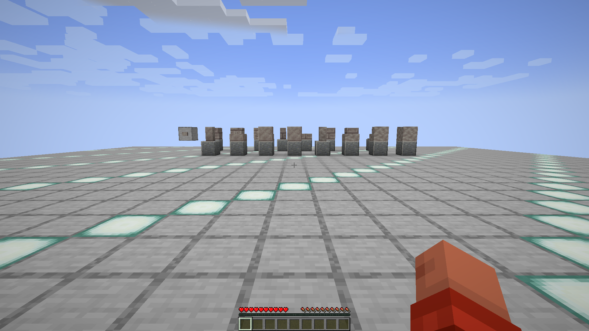
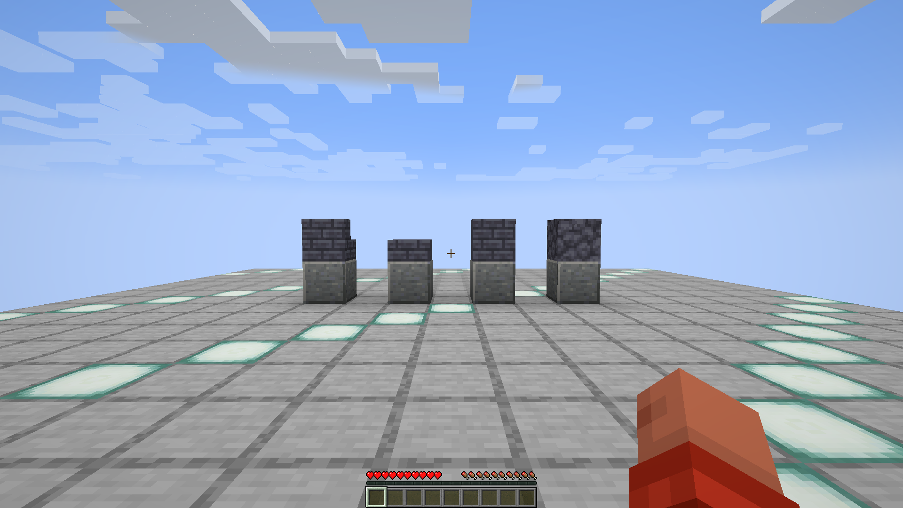

# Forge 1.20.1 runtime evidence

This directory contains frozen evidence captured from real Minecraft Forge
clients and a dedicated server on the baseline Mac. Every run used a new
repository-owned profile under `scripts/e2e/.state/`; none read, modified, or
derived data from an external launcher profile.

The latest tracked packaged-client contract is the consumed and accepted
`etherology-e2e-forge-1.20.1-v19` Slitherite profile. Its tracked manifest and
v19 snapshot are byte-identical at 3,737 bytes with SHA-256
`bd1de9eea5ff186a8391e29abfe9be3b4c79669718b52f42ff944eb75ab5670c`.
Its one native attempt passed stopped-live verification, archive sealing, and
archive-only verification. It is permanently consumed and must never be
provisioned, staged, checked, or launched again. The prior v18 client identity
is quarantined and permanently consumed after its
[pre-Java provisioning failure](provisioning-v18-pre-java-failure/); it must
never be provisioned or launched again. Its exact retained installer interlock
was safely released only after authenticated identity, byte, inode, mode, and
process-absence checks while preserving the quarantined staging runtime.

Accepted packaged-client v19 proved all five real related recipes and their
pedestal, alchemy, and lens dependencies, clearing the former server dependency
block. The authorized dedicated-server v20 attempt was then consumed by a
fail-closed process-group ownership rejection before the controller
acknowledged the authenticated Java 17 server. The exact attempt marker,
profile marker, handoff, and logs are retained in
[`slitherite-block-registry-server-v20-pgid-handoff-failure`](slitherite-block-registry-server-v20-pgid-handoff-failure).
It produced no scenario report, completion marker, world, or accepted archive,
and v20 must never be provisioned, checked, launched, cleaned for reuse, or
rerun.

The active mutable dedicated-server contract is now the fresh, prepared,
never-provisioned and never-launched
`etherology-e2e-forge-server-1.20.1-v21` Slitherite profile. Its active manifest
and immutable v21 snapshot are byte-identical at 4,478 bytes with SHA-256
`8df3f9c15f03c1ea9d5b6adea71ee352e9a2735ecdd22e26d03033d62f49f764`.
Accepted client v19 authorizes exactly one v21 native attempt but does not
pre-accept its server result. The planned order remains `forge_server.py
validate`, `provision`, `check`, then `run`, stopping on the first failure. The
replacement controller pins Gradle 9.6.1 on exact JDK 21 and keeps Gradle in
one heap-bounded direct wrapper JVM without a daemon. A small JDK 21 source-file
broker remains the stable process-group and session leader throughout the
wrapper and server lifecycle. Every Gradle invocation is
offline and uses a fixed allowlisted environment. Its repository-owned Gradle
home reuses only pinned symlink bridges to the existing `~/.gradle` `caches`,
`jdks`, `native`, and `wrapper` directories, avoiding an approximately 18-GiB
cache copy without importing global init scripts or `gradle.properties`.
The shared home and cache roots must remain owner-controlled, and the extracted
Gradle 9.6.1 distribution has a pinned, non-executable `init.d` inventory.

Both `check` and `run` acquire and pin one repository-global native-run lock
before any Java version probe or loader-free topology check. The version
probes require a protected root-owned Java executable, explicit memory and
processor caps, a fixed environment, and zero Java processes before and after
probing. Any retained active topology, launch-anchor, or wrapper-guard
transient blocks launch, and cleanup uncertainty retains the lock and relevant
transient or log.
Completed transient directories are atomically renamed through pinned parent
descriptors and retained as diagnostics instead of being recursively deleted.
The controller then starts the exact-JDK-21 broker with `-Xms16m`, `-Xmx64m`,
a 64-MiB direct-memory cap, a 128-MiB metaspace cap, a 64-MiB code-cache cap,
and two active processors. It authenticates and samples that stable anchor and
starts the detached watchdog before releasing the direct Gradle wrapper child.
While awaiting START, the broker requires its recorded controller to remain
its live parent and limits that wait to 30 seconds. A pre-START failure exits
with code 70. An authenticated START commits the release; later failures retain
the process group for the watchdog instead of abandoning its ownership.
Readiness records the parent PID and lease, and the evidence verifier
cross-links that controller identity to the watchdog.
The pre-acknowledgement contract permits zero untracked Java processes, gives
the controller two seconds to bind each child identity, bounds child
acknowledgement at 15 seconds and 2,147,483,648 heap bytes, and polls the
watchdog every 250 milliseconds.
The loader-free topology handshake then starts Java 17 with exactly
`-Xmx2048m` as the wrapper's direct child inside the broker-owned group and
session. The earlier non-broker topology probe passed on the baseline Mac with
about 619 MiB peak aggregate RSS observed externally; it loaded no game and
consumed no profile or launch attempt. The broker-backed v21 path itself has
not been launched.

For a native v21 attempt, persistent authenticated `strict-2g-v1` monitors
protect both the Gradle wrapper and Java 17 server before server
acknowledgement. Each warns above 3 GiB of current physical footprint, stops a
sustained breach above 4 GiB only after at least 10 of the latest 15 samples are
high including all final five, and emergency-stops after one sample above
5 GiB. Synchronous authenticated checks also reject any individual Java
identity above 5 GiB and the deduplicated set above 6 GiB aggregate. These are
implemented controls. The controller also requires a zero-Java baseline,
binds Java processes inside the owned group and session, and rejects Java outside
that group. Normal cleanup requires exact process/group absence and terminal
watchdog proof of global Java absence. Failure and incomplete-binding cleanup
additionally require 15 continuous seconds of global Java absence. These
are not v21 runtime evidence: v21 has not been provisioned or launched. The
preflight is control-plane validation, not v21 gameplay evidence.

The v21 launch object cryptographically pins the 63,659-byte broker controller
source at SHA-256
`8cb41e0ce36d1fa91fd2472b73e54e7e9b44974e5c13c27b692f35ce404699a5`,
the 41,275-byte Java source at SHA-256
`baca2862e9df7dd6c3da1f41583cbc4b013c45423ec77914883961dcfd202d2b`,
and the 59,821-byte Gradle wrapper JAR at SHA-256
`575098db54a998ff1c6770b352c3b16766c09848bee7555dab09afc34e8cf590`.
The fourth pinned repository input is the 339-byte wrapper properties file at
SHA-256
`ef9f8775fd21a165a249ded98afc533818d3f6ac050f0f2f437d5285576b2257`.
The Java source, wrapper JAR, and wrapper properties are the three inputs
staged as `0400` files in the isolated runtime and copied with that mode into
the captured archive. The Python controller is pinned but is not staged.
It also pins the detached persistent
watchdog source at 102,143 bytes with SHA-256
`a0d69fd1a3477fe13e7379d9088273c331e461ece2c6a8e6ebb868309e9c02e5`.
That independent process is ready before the anchor may release Gradle,
receives a 10-second controller heartbeat, permits at most three concurrent
Java identities in the owned group, retains up to 16 historical identities
for terminal proof, and enforces exact 5-GiB
per-process and 6-GiB aggregate current-physical-footprint ceilings. It
publishes owner-only
`.forge-server-launch-watchdog-ready.json` and
`forge-server-launch-watchdog-telemetry.json` artifacts and can accept cleanup
only after terminal telemetry proves the owned group, all tracked exact
identities, and the global Java inventory absent. A failed pre-readiness startup
still requires that full absence proof. The broker's owner-only readiness,
start, child-started, child-result, and finish artifacts bind its lifecycle to
one controller token. It retains leadership until the controller has proved
terminal launch quiescence and publishes the authenticated finish record.
These controls are statically prepared; the v21 safety task runs the anchor,
watchdog, and sampler unit tests without Java or Minecraft. No v21 anchor or
watchdog artifact exists, and v21 remains unprovisioned and unlaunched.

The immutable
[`attrahite-block-registry-server-v19`](attrahite-block-registry-server-v19)
archive remains the latest accepted cumulative dedicated-server evidence.

After a successful v21 native run, follow the exact
[v21 sealing commands](../../../scripts/e2e/README.md#sealing-the-successful-v21-dedicated-server-run)
from the repository root. They validate the stopped runtime before creating the
absent `slitherite-block-registry-server-v21` archive, copy its 18 payloads,
write `archive-manifest.json` once, and verify all 19 files. The archive has
`reports/`, `logs/`, `memory-guard/`, `launch-watchdog/`, and `launch-anchor/`
directories. `launch-anchor/` contains the five lifecycle records and the three
staged inputs. Their captured copies retain `0400`; archive-only validation
checks pinned bytes without requiring that mode after Git checkout. Sealing
and verification launch no Java or game and never authorize another v21 run.

## Latest accepted Slitherite packaged client (v19)

The one-shot `etherology-e2e-forge-1.20.1-v19` profile ran the packaged
`slitherite-block-registry` scenario in a fresh integrated world. Its stopped
live runtime and frozen archive both passed the strict verifier with all 185
ordered assertions, and the run published two unedited native 1920x1080
composed Minecraft framebuffers. Provisioning and launch consulted no external
game profile.



- Profile manifest: `3,737` bytes, SHA-256
  `bd1de9eea5ff186a8391e29abfe9be3b4c79669718b52f42ff944eb75ab5670c`
- Minecraft: `1.20.1`; Forge: `47.4.9`; runtime Java: `17`
- Production JAR: `1,481,320` bytes, SHA-256
  `cd04317e1eca88a3009d0c64147028905af253a82e7f6122ec6523508542df56`
- Harness JAR: `350,530` bytes, SHA-256
  `11f6304acf46aae7b20306f537cfc8c7c3650432a33a0e26a9f828e1efbecf96`
- Report status: `passed`; assertions: `185` passed, `0` failed
- Client ticks: `374`
- Reopened material changed-pixel ratio: `0.034870`
- Peak physical footprint: `4,601,877,520` bytes (about `4.286 GiB`)
- Peak RSS: `4,064,100,352` bytes (about `3.785 GiB`)
- Memory enforcement: none

The verifier proves the exact 17 block/item pairs and all 1,262 states, 79
visual resources, 11 tags, 17 loot tables, 29 owned recipes and their 29
advancements, and five related recipes. Those related recipes include the real
`etherology:pedestal` crafting result and real
`etherology:unadjusted_lens` alchemy result. It also checks native
`BlockItem` placement for all 17 blocks, button and pressure-plate behavior,
exact client/server mirrors, fixed-camera rendering after 120 consecutive
stable frames per capture, and exact fixture and loaded-data persistence after
force-save, disconnect, and reopen.

The stopped-live verifier passed before the four payloads were copied with
preserved timestamps. The seal then bound those exact bytes to the v19 profile
and staged artifact lock, and archive-only verification passed. The following
are the exact completed commands. They are retained only as historical
provenance and must not be rerun against v19:

```bash
python3 -B scripts/e2e/forge_slitherite_evidence_v19.py --live
/bin/mkdir docs/evidence/forge-1.20.1/slitherite-block-registry-v19
/bin/cp -pR \
  scripts/e2e/.state/runtimes/etherology-e2e-forge-1.20.1-v19/evidence/slitherite-block-registry/. \
  docs/evidence/forge-1.20.1/slitherite-block-registry-v19/
python3 -B scripts/e2e/forge_slitherite_evidence_v19.py \
  --create-archive-manifest docs/evidence/forge-1.20.1/slitherite-block-registry-v19 \
  --capture-runtime scripts/e2e/.state/runtimes/etherology-e2e-forge-1.20.1-v19 \
  --profile-manifest scripts/e2e/forge-1.20.1-profile.json
python3 -B scripts/e2e/forge_slitherite_evidence_v19.py \
  --archive docs/evidence/forge-1.20.1/slitherite-block-registry-v19
```

Frozen file digests:

- `slitherite-block-registry-v19/archive-manifest.json`:
  `05e6441d89f4333b503277be59f7385303954ae2586d4d5759ea84ca01209e2e`
- `slitherite-block-registry-v19/reports/report.json`:
  `57731c4f72c6b6a2c840bfccebd416ff2a174d049e0cd8f54924e177f55dad9b`
- `slitherite-block-registry-v19/reports/done.marker`:
  `37a40f08d8548dba289b9b0bb35bcf63b359f6d37ee86044ebc6b6da080b9ec1`
- `slitherite-block-registry-v19/screenshots/slitherite-block-registry-initial.png`:
  `53dddd5f21cd56620c3605a6615c36c3414b9849177f6f732699f43bd98063d5`
- `slitherite-block-registry-v19/screenshots/slitherite-block-registry-reopened.png`:
  `f6baa52571c57609d2b753e4bd70c1179bd798f1e355970ee86afb37a5db9699`

The v19 identity and its evidence are immutable. Any later Forge
packaged-client run requires a new v20-or-newer client identity; the existing
dedicated-server v20 identity is a separate consumed failure and must never be
reused. The fresh dedicated-server replacement is v21; it has not been
provisioned or launched.

## Historical accepted Attrahite packaged client (v17)

The one-shot `etherology-e2e-forge-1.20.1-v17` profile ran the packaged
`attrahite-block-registry` scenario in a fresh integrated world. The report
passed all 91 assertions in 378 client ticks, force-saved, disconnected,
reopened the world, and published two unedited native 1920x1080 composed
framebuffers. Provisioning and launch consulted no external game profile.



- Profile manifest: `3,702` bytes, SHA-256
  `00475fd4af5741119b44b3ca70484e967ee0b7a8c51fdc222ebdde3e2bf0ba58`
- Minecraft: `1.20.1`; Forge: `47.4.9`; runtime Java: `17`
- Production JAR: `1,311,266` bytes, SHA-256
  `b2ac29597159c6089a12cfdebd8d8e1c19b9f528cb0b52a29ec829b1c35bc47b`
- Harness JAR: `244,324` bytes, SHA-256
  `9921ec314c9aa411ca1c2f9632faa1a9e05a60b62589d12a416c228bc85170b8`
- Report status: `passed`; assertions: `91` passed, `0` failed
- Reopened whole-frame changed-pixel ratio: `0.250786`
- Reopened structural-change ratio: `0.001778`
- Gallery mean luminance: `159.441135` initial, `160.264757` reopened
- Gallery median luminance: `164` initial, `165` reopened
- Gallery dark-pixel ratio: `0.000485` in both captures

The verifier proves the exact four block/item registrations, runtime classes,
default states, valid unique non-negative default-state network IDs, canonical
resources, block/item tags, four loot tables, nine recipes and advancements,
native `BlockItem` placement, plain, Silk Touch, and seeded Fortune III loot,
and exact structural/data persistence after reopen. Before the first fixture
mutation, 20 consecutive client ticks proved all four arena chunks loaded, an
empty terrain-build queue, an idle lighting provider, all four light columns
enabled, and all six future SKY samples at 15. Both captures then held exact
camera, mirror, lighting, and render readiness for 120 composed frames.

The whole-frame delta comes from moving clouds and background shading. Direct
pixel decoding confirms all four gallery columns remain in the same positions:
the structural delta and gallery-lighting metrics remain within their strict
limits, and no missing-texture pixels occur.

Frozen file digests:

- `attrahite-block-registry-v17/archive-manifest.json`:
  `cc4450a4b29b26e87b0d287c623772e077cdff085e279798624f882ee3931752`
- `attrahite-block-registry-v17/reports/report.json`:
  `d014611812aa19431339716f91dc963b0c53de04af1987d6ece5dac611c94eb1`
- `attrahite-block-registry-v17/reports/done.marker`:
  `37a40f08d8548dba289b9b0bb35bcf63b359f6d37ee86044ebc6b6da080b9ec1`
- `attrahite-block-registry-v17/screenshots/attrahite-block-registry-initial.png`:
  `1acb9186fa06979535066dafdaea5607458326c1f9414c6f285d5d5983b9753d`
- `attrahite-block-registry-v17/screenshots/attrahite-block-registry-reopened.png`:
  `865818a3d23bdaf1a30ec54c5374ed6d70bc3171e99237d55ec021ad02feba76`

Repeat the archive-only check with:

```bash
python3 -B scripts/e2e/forge_attrahite_evidence_v17.py \
  --archive docs/evidence/forge-1.20.1/attrahite-block-registry-v17
./gradlew \
  :forge:1.20.1:validateForgeAttrahiteBlockRegistryClientEvidenceArchiveIntegrity \
  --no-daemon --console=plain
```

This is a bounded block-family, loot, recipe, rendering, and persistence proof;
it does not establish natural Attrahite generation. The v17 identity is
permanently consumed and must not be provisioned, staged, checked, or launched
again. It remains the accepted historical Forge packaged-client Attrahite
archive; the v19 Slitherite archive above is the latest packaged-client proof.

## Forest Lantern dedicated server (v16)

- Profile: `etherology-e2e-forge-server-1.20.1-v16`
- Runtime directory:
  `scripts/e2e/.state/runtimes/etherology-e2e-forge-server-1.20.1-v16`
- Scenario: `forest-lantern`
- Tracked profile manifest: `1184` bytes, SHA-256
  `82419a84d0bca220b5032f45fec053265ed5701594af32fd3721d02a66862332`
- Minecraft: `1.20.1`; Forge: `47.4.9`; runtime Java: `17`
- Distribution: `DEDICATED_SERVER`; execution: repository-owned Loom userdev
- Named task: `:forge:1.20.1:runRegistryFoundationServerProbe`
- Report schema: `10`; archive-manifest schema: `1`
- Report status: `passed`; assertions: `266` passed, `0` failed
- Launcher exit code: `0`; timed out: `false`

The native run proves the exact shared Forest Lantern block/item identity and
mapping, mature north default, all twenty age/facing states, unique non-negative
server network IDs, exact shapes and upstream-derived block properties. In
particular, Minecraft 1.20.1 reports `opaque=true` for the upstream
`notSolid()` construction while the block remains non-full-cube and transparent.
The run also verifies the hoe and deliberately empty peach-log tags, age-gated
loot, four recipes and advancements, real four-facing `BlockItem` placement and
support removal, shears speed and breaking delta across all twenty states, and
seeded retain/break/drop jump outcomes. All registry, data, and mechanic checks
remain exact after a real reload; the world saves and stops normally.

The prior v15 identity is consumed and has no accepted archive. Its native run
passed 262 assertions; four aggregate assertions failed because the prepared
oracle incorrectly expected `opaque=false`. v16 corrected only that oracle and
used a distinct one-shot identity.

Frozen file digests:

- `forest-lantern-server-v16/archive-manifest.json`:
  `c4c0062bf821510c49c54af9664227b4ac798f25528cb901bd1640c5a2bc55bf`
- `forest-lantern-server-v16/reports/report.json`:
  `af7bf8ca10dfc5b34da104daa7c4f6df4d3ecbcb879e1cab7cef75e27b33913a`
- `forest-lantern-server-v16/reports/launcher-result.json`:
  `3c9aa1d335445fcb2e2f776f1b27527ed0f4baca87f07ef822f8d09be2ae0a2a`
- `forest-lantern-server-v16/reports/done.marker`:
  `37a40f08d8548dba289b9b0bb35bcf63b359f6d37ee86044ebc6b6da080b9ec1`
- `forest-lantern-server-v16/logs/latest.log`:
  `9a7c0d69aee66897cb7766b688a487fe98bc649e45f2a708a3c320283ed3935e`

Run the archive-only verifier from the repository root:

```bash
python3 -B scripts/e2e/forge_server_forest_lantern_evidence_v16.py \
  --archive docs/evidence/forge-1.20.1/forest-lantern-server-v16
```

It reports `266 assertions` and checks the sealed five-file inventory,
publication ordering, exact report contract, profile provenance, and server
log. This headless proof intentionally contains no screenshots. It does not
claim natural immature attachment while the Golden Forest graph is deferred,
a second JVM, multiplayer, client rendering, creative-tab interaction, the
full authoritative registry, or release readiness. The accepted v13 packaged
client below supplies the separate rendering and restart-persistence boundary.

## Forest Lantern packaged client (v13)

- Profile: `etherology-e2e-forge-1.20.1-v13`
- Runtime directory:
  `scripts/e2e/.state/runtimes/etherology-e2e-forge-1.20.1-v13`
- Scenario: `forest-lantern`
- Tracked profile manifest: `3668` bytes, SHA-256
  `0e00a169d9e9387747b9cdf1d2d682b4646b731e2244775d676794f6cc2405c6`
- Minecraft: `1.20.1`; Forge: `47.4.9`; runtime Java: `17`
- Report status: `passed`; assertions: `69` passed, `0` failed
- Client ticks: `575`
- Captures: seven unedited composed Minecraft framebuffers at `1920x1080`
- Minimum consecutive-capture transition ratio: `0.008954`
- Production JAR: `1293659` bytes, SHA-256
  `45a628ddbe67dd90c0d713fa0788caebb17bff071689e2e05b45dbbaed4c8732`
- Harness JAR: `164691` bytes, SHA-256
  `2082b006646371e9339467bb59daa80d7d0c62d1102864ba56fa9b668c00dde9`

The real integrated-world run proves the exact block/item mapping, all twenty
age/facing states and raw IDs, thirteen hash-locked render resources, baked
models, Forge's effective cutout render type, luminance 8, unsupported
placement rejection, and four real direction-correct mature `BlockItem`
placements. It captured the empty supports, all sixteen forced immature states,
each cumulative mature facing, and the reopened final fixture after 120 stable
renders per frame. A forced save, full disconnect, server restart, and reopen
preserved the complete server/client matrix exactly.

Visual inspection confirms that the seven fixed-camera images progress from
empty supports through the transparent luminous growth models and the four
cumulative mature placements. The reopened fixture matches the final state;
there are no missing-texture magenta surfaces or opaque-geometry regressions.

Frozen file digests:

- `forest-lantern-v13/archive-manifest.json`:
  `552e712a809855b6c29d90dee096ef409e466618b514db7480fc71aebf5c33c9`
- `forest-lantern-v13/reports/report.json`:
  `d14aad2770b2a8746823ccf23f6935a0ba8f3cc3ab72b226455bfeb58ea47cb1`
- `forest-lantern-v13/reports/done.marker`:
  `37a40f08d8548dba289b9b0bb35bcf63b359f6d37ee86044ebc6b6da080b9ec1`
- `forest-lantern-v13/screenshots/forest-lantern-empty.png`:
  `2e420a5e622c0579461cbc279d3b8008dea8c00c308f46d59ee9836aa8b698ee`
- `forest-lantern-v13/screenshots/forest-lantern-stages.png`:
  `45f242714e0de081af95afe4c08e83caa28d8d8a3dc54d89d60a2838a5ca0969`
- `forest-lantern-v13/screenshots/forest-lantern-facing-north.png`:
  `023416f983f0e26bde8002a548124ef034743e3b3c52d2b04c303f51fe5781b4`
- `forest-lantern-v13/screenshots/forest-lantern-facing-east.png`:
  `b85f70c6bc5ebd7673823c881cd0504f77fcf5e096f6e23a6dfe7ee8afd638a9`
- `forest-lantern-v13/screenshots/forest-lantern-facing-south.png`:
  `f8dfab6e9c5054b7907d4456425ef92e66a1e9b2a57ba616fe3e96bc7dfb89df`
- `forest-lantern-v13/screenshots/forest-lantern-facing-west.png`:
  `604bc8c61d019bb6228667297a183432b89ee35ff2160692b5fffe12b1f4b9ce`
- `forest-lantern-v13/screenshots/forest-lantern-reopened.png`:
  `e548476369065744fa850c4a49f18d02afbeefab82064c6795930accec736989`

Run the archive-only verifier from the repository root:

```bash
python3 -B scripts/e2e/forge_forest_lantern_evidence.py \
  --archive docs/evidence/forge-1.20.1/forest-lantern-v13
```

It reports `69 assertions`, seven screenshots, and the minimum transition ratio
above. The v13 profile and runtime are consumed and must never be relaunched;
any later Forge packaged-client run requires a new v14-or-newer identity.

### Failed v12 diagnostic

The repository-owned `etherology-e2e-forge-1.20.1-v12` profile is permanently
consumed by its native Forest Lantern diagnostic. Its report recorded 69
assertions: 12 passed and 57 cascaded from one harness false negative, with zero
screenshots. Production Forge registration was correct; the probe queried the
deprecated `RenderLayers` map and observed solid instead of using
`BakedModel#getRenderTypes`, which returns the exact cutout render type. No v12
archive was accepted. Its tracked 3,668-byte profile snapshot has SHA-256
`c23a2a905e40c721cda1d45086064667aacd568489a319eef4ce30e153a2a8d7`,
and neither that snapshot nor its repository-owned runtime may be reused.

The corrected query was exercised only with the distinct v13 identity above;
v12 was not retried.

## Ethereal Storage (v7)

- Profile: `etherology-e2e-forge-1.20.1-v7`
- Runtime directory: `scripts/e2e/.state/runtimes/etherology-e2e-forge-1.20.1-v7`
- Tracked profile manifest SHA-256:
  `56244f01a169f6189b8f89f6c32ba7bd1d4edc7c573481d47f96f56f6018ccb7`
- Minecraft: `1.20.1`
- Forge: `47.4.9`
- Runtime Java: `17`
- Forge installer SHA-256:
  `58fc5db6e3dc47745475375be6fa275e68320563c05d29b4203e0d2ca57a50c4`
- Vanilla client SHA-256:
  `56b71336d2b4fdffd197f56595b0da93e32a946f78f382a299b8f4b92758bb0f`
- Architectury Forge 9.2.14 SHA-256:
  `47d5eca3d83aae1ac1d4a70116727715bd7ef4c077d228fee873065cbca94687`
- GeckoLib Forge 4.7.4 SHA-256:
  `6ccdc4001520a098f0af16cebcabc2edde655a64ca39f7acd1e4c90e31bc5164`
- Production JAR SHA-256:
  `c634d89d61b0ea6ccd8d9e523e6c8928446b8cf7c98d5b80d0691c1847063006`
- Harness JAR SHA-256:
  `4a28be83711c5c68dc1749197f0f1a00ccb7029b89496a408cd3e7913d9e288b`
- Report status: `passed`
- Assertions: `34` passed, `0` failed
- Client ticks: `438`
- Centered-storage ROI, closed to open: `0.253670`
- Centered-storage ROI, closed return: `0.001168`

The disposable runtime materialized the Forge child-version client JAR from the
exact pinned vanilla bytes. The parent and child JARs are both 23,028,853 bytes
and have the vanilla client digest recorded above.

The real integrated-world fixture verifies the four-slot storage block entity,
NBT reconstruction, simulated and live Glint insertion through Forge
`ITEM_HANDLER` on the unsided view and all six faces, blocked extraction, and a
hidden display slot. Starting with 64 internal Ether and 64 Ether in one Glint,
the run observes transfer while preserving 128 total Ether. It then waits for a
quiescent state of 0 internal Ether and 128 Glint Ether, force-saves, disconnects,
restarts the integrated world, compares the exact Ether distribution, ordered
input inventory, display state, and block-entity type, and reopens the native
menu. Viewer open and close calls also drive the captured Gecko animation.

## Ethereal Storage capture contract

All five PNGs are composed Minecraft framebuffers at `1920x1080`; none is an
operating-system screenshot or crop. The world captures wait for 16 completed
closed renders, 48 completed open renders, and 60 completed closed-again renders.
Both menu captures wait for two completed screen renders. The live verifier
compares the centered storage region (`45%..55%` horizontally and
`36%..62%` vertically), requiring a material closed-to-open change and a return
near the original closed state. It also checks PNG CRCs and dimensions, rejects
blank frames, validates the exact screenshot inventory and artifact lock, scans
logs and crash reports, requires a normal shutdown, and confirms that
`done.marker` was published last.

Frozen file digests:

- `ethereal-storage-v7/archive-manifest.json`:
  `e5cb1dfd8dc988d949de13668af420eec81d4fff6b0734e837ddfd699598a096`
- `ethereal-storage-v7/reports/report.json`:
  `5fe0e9d124206d1be07e9c2db3a4dc488b84f220267ef412ebd868ad23b91048`
- `ethereal-storage-v7/reports/done.marker`:
  `37a40f08d8548dba289b9b0bb35bcf63b359f6d37ee86044ebc6b6da080b9ec1`
- `ethereal-storage-v7/screenshots/ethereal-storage-closed.png`:
  `6794bbf178f1bbc24d6ee0c95f99efb9df439fd782acea80267fd0bc54a7ce5b`
- `ethereal-storage-v7/screenshots/ethereal-storage-open.png`:
  `956cac7e9d584d57630fb4db062cb49c0944fe01215a56953665dff59dc5ac73`
- `ethereal-storage-v7/screenshots/ethereal-storage-closed-again.png`:
  `626d41d543ac02e794083a1bf61cdb36677a02ce66254d3d25a99bd0f9e21d8c`
- `ethereal-storage-v7/screenshots/ethereal-storage-menu.png`:
  `878a3d8fa8d81fd0d99c9da4132db28b9a720fca42bedf86459ab2a45ba55336`
- `ethereal-storage-v7/screenshots/ethereal-storage-reopened.png`:
  `550b1e762ee99e9b162313296e2adbbe16712363c9459fc01ef926f44591b334`

The complete assertion inventory and artifact provenance are in
[`report.json`](ethereal-storage-v7/reports/report.json). The eight-file archive
can be checked without the ignored live runtime:

```text
Validated archived ethereal-storage for etherology-e2e-forge-1.20.1-v7: 34 assertions, 5 screenshots, closed-to-open 0.253670, closed-return 0.001168
Production SHA-256: c634d89d61b0ea6ccd8d9e523e6c8928446b8cf7c98d5b80d0691c1847063006
Harness SHA-256: 4a28be83711c5c68dc1749197f0f1a00ccb7029b89496a408cd3e7913d9e288b
Archive integrity only: current sources and rebuilt artifacts were not compared.
```

Run `python3 -B scripts/e2e/forge_evidence.py --archive
docs/evidence/forge-1.20.1/ethereal-storage-v7` from the repository root to
repeat that archival check. It proves the tracked report, marker, images, and
capture-time artifact provenance remain internally intact. It deliberately does
not claim that later source changes or rebuilt JARs still match this capture; a
new isolated profile and native run are required for that claim.

This is proof for the bounded Forge Ethereal Storage vertical only. It does not
open the Forge release gate or establish parity for channels, the wider Ether
network, the remaining gameplay graph, dedicated-server behavior, or the full
E2E matrix.

## Ethereal Channel (v11)

- Profile: `etherology-e2e-forge-1.20.1-v11`
- Runtime directory: `scripts/e2e/.state/runtimes/etherology-e2e-forge-1.20.1-v11`
- Tracked profile manifest SHA-256:
  `af21ba7cbf1ba71f06a1dc2594daa5aa4a790ee89df3ed560760ceb1b6aa8e6f`
- Minecraft: `1.20.1`
- Forge: `47.4.9`
- Runtime Java: `17`
- Production JAR SHA-256:
  `45e94cf67b0be441aae529df08ede9602e3d6d67f07e3570d1facd067b0cfa12`
- Harness JAR SHA-256:
  `e229554424abf1896436d87298d4788786e784fd987f96fe731b1c42a54f5284`
- Report status: `passed`
- Assertions: `42` passed, `0` failed
- Client ticks: `3434`
- Gated-to-transferred change: `0.013136`
- Transferred-to-reopened structure: `0.004009`

The fresh integrated-world fixture verifies the shared ethereal-channel
foundation with registered channel and storage endpoints, persistent Ether and
direction state, redstone activation, and native Forge support for a vanilla
wall lever attached to the channel. A powered channel first receives and holds
exactly one Ether. Removing the gate transfers that Ether to storage on the
fifth-tick cadence without reverse motion. An independent channel with a
missing output then evaporates exactly `0.2` Ether on its fifth-tick cadence and
naturally clears its evaporation state after reactivation. The run force-saves,
disconnects, restarts the integrated world, and compares the exact Ether,
activation, direction, lever, and block-entity state.

## Ethereal Channel capture contract

All three PNGs are composed Minecraft framebuffers at `1920x1080`. Before each
capture, the client sustained 120 consecutive frames with the exact expected
block and block-entity mirror, a complete and ready terrain render, and the
fixed first-person camera pose. The harness rechecked and latched those three
conditions immediately before recording each screenshot. The deterministic
verifier requires the gated-to-transferred change recorded above, limits
unrelated scene movement, and requires the reopened image to retain the
transferred structure. It also validates PNG dimensions, archive inventory,
artifact provenance, assertion evidence, normal shutdown, and publication of
`done.marker` only after the report and captures were complete.

Frozen file digests:

- `ethereal-channel-v11/archive-manifest.json`:
  `b04886bf18b8f74a8bbfed0d0d48e2ae7f0b32321aa820952280673ec3fd70be`
- `ethereal-channel-v11/reports/report.json`:
  `80c31a4ca1e0e3c1000de48f83b374cf3ae17dcf43e76d0d1fac0cbaa9204203`
- `ethereal-channel-v11/reports/done.marker`:
  `37a40f08d8548dba289b9b0bb35bcf63b359f6d37ee86044ebc6b6da080b9ec1`
- `ethereal-channel-v11/screenshots/ethereal-channel-gated.png`:
  `ffcd33ea596992a39afb86d1011467cf95207d0e02f43968f438bcffe7f38006`
- `ethereal-channel-v11/screenshots/ethereal-channel-transferred.png`:
  `e33947206f968a5f8005e6e4163c588f9464e70484d485bd68f6d7e912fdb901`
- `ethereal-channel-v11/screenshots/ethereal-channel-reopened.png`:
  `5860d53c1f9c56b12d91469c043faae98ab8bc2876b52f696adcaa5fc00cfa01`

The complete assertion inventory and artifact provenance are in
[`report.json`](ethereal-channel-v11/reports/report.json). The six-file archive
can be checked without the ignored live runtime:

```text
Validated archived ethereal-channel for etherology-e2e-forge-1.20.1-v11: 42 assertions, 3 screenshots, transfer-change 0.013136, reopened-structure 0.004009
Production SHA-256: 45e94cf67b0be441aae529df08ede9602e3d6d67f07e3570d1facd067b0cfa12
Harness SHA-256: e229554424abf1896436d87298d4788786e784fd987f96fe731b1c42a54f5284
Archive integrity only: current sources and rebuilt artifacts were not compared.
```

Run `python3 -B scripts/e2e/forge_channel_evidence.py --archive
docs/evidence/forge-1.20.1/ethereal-channel-v11` from the repository root to
repeat that archival check. The frozen archive proves only its own integrity;
later source changes and rebuilt JARs require another fresh isolated profile and
native run before they can claim equivalence.

`validateForgeChannelEvidenceArchiveIntegrity` is the positive Gradle gate for
that immutable historical record. `validateForgeChannelCurrentArtifactDiagnostic`
is deliberately separate: it compares the current whole production and harness
JARs with their capture-time digests. It now fails because later registry
milestones changed the production JAR after this capture. That
expected whole-JAR mismatch neither invalidates the archive nor demonstrates a
Channel regression, and it must not be described as current-artifact equality.
Only a new isolated native run can establish equality for later artifacts.

This accepts only the shared ethereal-channel foundation and its bounded
network behavior with storage endpoints and native Forge lever support. Channel
case interaction and registration, channel particles and the client ticker,
channel loot and recipe data, and the wider machine/network graph remain
deferred. The bounded SharedSounds, SharedGameEvents, SharedLootConditions, and
SharedEnchantments registry foundation has since passed. The exact shared
particle registry and server-side wire contract have also passed, but no native
sound-playback, enchantment-gameplay, or particle-rendering E2E was run. The
14 behavior-free material items and their bounded server registry/NBT contract
have passed as well. The three behavior-free metal blocks, their corresponding
block items, and their bounded server registry/property/tag/NBT/placement
contract have now passed. The plain `forest_lantern_crumb` food item and its
bounded registry/reload/native-consumption contract have now passed as well. The
broader authoritative registry spine is the next forward gate. The Forge
release gate remains closed.

## Historical food-item-registry dedicated server (v14)

- Profile: `etherology-e2e-forge-server-1.20.1-v14`
- Runtime directory:
  `scripts/e2e/.state/runtimes/etherology-e2e-forge-server-1.20.1-v14`
- Scenario: `food-item-registry`
- Tracked profile manifest SHA-256:
  `442d11e6a5072c8ec418bced406529dc15caa6d4f4d4c5c68edc8a79ce2e493d`
- Tracked profile manifest size: `1192` bytes
- Minecraft: `1.20.1`
- Forge: `47.4.9`
- Runtime Java: `17`
- Distribution: `DEDICATED_SERVER`
- Execution: fresh repository-owned Loom-userdev dedicated server
- Named task: `:forge:1.20.1:runRegistryFoundationServerProbe`
- Report schema: `9`; archive-manifest schema: `1`
- Report status: `passed`
- Assertions: `219` passed, `0` failed
- Launcher exit code: `0`; timed out: `false`
- Copied server-log SHA-256:
  `e2bba0e01d27a7f9f4511d00b2d3fa3a12c8d9fa4b5aaa74cca09ca536d599db`

`SharedFoodItems` is the sole Common deferred owner of exactly the plain
`etherology:forest_lantern_crumb` vanilla `Item`. Its food component has hunger
3 and saturation modifier 2.0, and it has no always-edible behavior, status
effects, or recipe remainder. The packaged model SHA-256 is
`6ba61590386580a2f70526313d501eec44cd88ff9d86cd1d13d9092b41a42fbe`;
the packaged texture SHA-256 is
`44f9d92ccf36c3555d21ace9eea0268e43eb4a8e95f1e81b74f22977d4928d65`.
The exact translations are `Mushroom Crumb` in English and `Грибной мякиш` in
Russian. At this v14 checkpoint, the three original recipes and their three
advancements referenced the then-unported `etherology:forest_lantern`, so they
were deliberately absent instead of loading invalid data or substituting
another input. The later accepted Forest Lantern slice packages all six.

The native server created two real `ServerPlayerEntity` instances,
`EtherFoodStart` and `EtherFoodReload`. It captured the exact registry ID,
runtime class, food properties, stack state, and deterministic save
representation before and after a real `reload`, with exact reload stability.
Real consumption changed hunger from 10 to 13, saturation from 0 to 12, and the
stack count from 2 to 1 while retaining the same `ItemStack` instance. The report
cumulatively re-proved the v13 metal-block, v11 material-item, v10 particle, v7
enchantment, game-event/tag, loot-condition, and Ether-source contracts. The
world saved, normal `stop(false)` completed, the launcher exited zero, and the
copied log passed the strict verifier scan.

Frozen file digests:

- `food-item-registry-server-v14/archive-manifest.json`:
  `eacab05996569a78a55ed21117d2a7e0768d87c258c93757cdc4ab4205881927`
- `food-item-registry-server-v14/reports/report.json`:
  `3ccd86d4ef6f5b31fd37b686254bdf427e351019c778d2d8e3f03958de0e1f6c`
- `food-item-registry-server-v14/reports/launcher-result.json`:
  `4ec610688bf030ea722772c40d871ec1b954fcbc0b15f90cbad41acec6278ad0`
- `food-item-registry-server-v14/reports/done.marker`:
  `37a40f08d8548dba289b9b0bb35bcf63b359f6d37ee86044ebc6b6da080b9ec1`
- `food-item-registry-server-v14/logs/latest.log`:
  `e2bba0e01d27a7f9f4511d00b2d3fa3a12c8d9fa4b5aaa74cca09ca536d599db`

Validate the five-file archive without the ignored live runtime:

```bash
python3 -B scripts/e2e/forge_server_food_item_evidence_v14.py \
  --archive docs/evidence/forge-1.20.1/food-item-registry-server-v14
```

```text
Validated archived food-item-registry for etherology-e2e-forge-server-1.20.1-v14: 219 assertions
Server log SHA-256: e2bba0e01d27a7f9f4511d00b2d3fa3a12c8d9fa4b5aaa74cca09ca536d599db
Archive integrity only: current sources and rebuilt artifacts were not compared.
```

The pinned v14 food-item runner/verifier safety suite contains 87 passing tests:

```bash
python3 -B -m unittest \
  scripts/e2e/test_forge_server.py \
  scripts/e2e/test_forge_server_food_item_evidence_v14.py
```

Separately, the executable Gradle interlock task passes 20 non-Minecraft
fixture cases and is wired into `forgeFoodItemRegistryServerSafetyTest`:

```bash
./gradlew --no-daemon --no-parallel --console=plain \
  :forge:1.20.1:serverProbeSafetyInterlockTest
```

The 20 Gradle fixture cases and 87 Python tests are distinct suites, not one
107-test count.

The integrated positive milestone and forward-gate diagnostic are:

```bash
./gradlew --no-daemon --no-parallel --console=plain \
  :forge:1.20.1:validateForgeFoodItemRegistryMilestone \
  :forge:1.20.1:verifyForgePortGateClosed
```

The v14 profile is durably consumed. Once its archive is sealed, the runner
rejects both reprovisioning and environment checks even if the ignored runtime
directory is removed. The raw Gradle launch task additionally requires the
exact cryptographic runner token and matching lock, exact tracked profile
marker, and pristine live evidence directories. Direct, stale, or replayed
launches fail before Minecraft starts in the normal runner flow. These are
accidental-misuse interlocks, not provenance authentication; same-account
adversarial or concurrent filesystem mutation and TOCTOU are outside the
bounded threat model.

This v14 headless evidence creates no screenshots and supplies no client visual
proof. At that checkpoint it did not prove a second JVM or restart persistence,
multiplayer, the then-deferred recipe/advancement resources, creative-tab
interaction, client rendering/gameplay, the complete authoritative registry, a
complete port, or release readiness. Its immutable archive proves capture-time Loom-userdev
observations and payload integrity only; it does not compare or
cryptographically bind later sources or rebuilt JARs. Current static artifact
checks are a separate proof boundary.

## Historical metal-block-registry dedicated server (v13)

- Profile: `etherology-e2e-forge-server-1.20.1-v13`
- Runtime directory:
  `scripts/e2e/.state/runtimes/etherology-e2e-forge-server-1.20.1-v13`
- Scenario: `metal-block-registry`
- Tracked profile manifest SHA-256:
  `c4112b8c4073168af573b4bb555d2f1d775ce57911046aaf352e8f569f10bd11`
- Tracked profile manifest size: `1196` bytes
- Minecraft: `1.20.1`
- Forge: `47.4.9`
- Runtime Java: `17`
- Distribution: `DEDICATED_SERVER`
- Execution: fresh repository-owned Loom-userdev dedicated server
- Named task: `:forge:1.20.1:runRegistryFoundationServerProbe`
- Report schema: `8`; archive-manifest schema: `1`
- Report status: `passed`
- Assertions: `188` passed, `0` failed
- Launcher exit code: `0`; timed out: `false`
- Copied server-log SHA-256:
  `f894973c95660d7a5b9e075a05b09874b27d63321c55d4513dfadee648c06ca4`

`SharedMetalBlocks` is the sole Common deferred block owner and
`SharedMetalBlockItems` is the sole Common deferred item owner for exactly:

```text
etherology:azel_block, etherology:ebony_block, etherology:ethril_block
```

The static gate verifies the exact declarations, attachment order, absence of
the former eager `DecoBlocks` fields, correct block-to-item map enrollment, and
packaged models, textures, English names, self-drop tables, compression and
decompression recipes, and selected tags across the Common and loader
artifacts. In the two tag files packaged by this bounded Forge slice—
`mineable/pickaxe` and `needs_iron_tool`—still-unported IDs use
`required: false`, while the three accepted metal-block IDs remain required.
`needs_stone_tool` is unchanged and outside this Forge resource slice. This
optionality fix prevents the partial Forge catalog from failing data load
without pretending the unported blocks exist.

The native server resolved every block as `net.minecraft.block.Block` and
every corresponding item as `net.minecraft.item.BlockItem`, with exact
block-item and `Block.asItem()` mappings. Azel had hardness `5`, blast
resistance `6`, and lapis-blue map color; ethril had hardness `3`, blast
resistance `6`, and gold map color; ebony had hardness `5`, blast resistance
`6`, and orange map color. All three used the metal sound group, required the
correct tool, had zero luminance, were opaque full cubes, had maximum item
count 64, were pickaxe-mineable, and required an iron-tier tool. Only ethril
and ebony were members of the beacon-base tag. Maximum-count stacks serialized
exactly the `id` and `Count` keys and round-tripped to the same items/counts.

The probe directly placed azel, ebony, and ethril at `8,200,8`, `9,200,8`, and
`10,200,8`. Those exact placed IDs, along with registry identities, mappings,
properties, selected tags, and stack NBT, remained stable after a real
`reload`. The report cumulatively re-proved the v11 material-item, v10 particle,
v7 enchantment, game-event/tag, loot-condition, and Ether-source contracts. The
exact lifecycle was `tags_updated_initial`, `server_started`,
`reload_requested`, `tags_updated_reload`, `reload_command_returned`,
`stop_requested`, `server_stopping`, and `server_stopped`. The world saved,
normal `stop(false)` completed, the launcher exited zero, and the copied log
passed the strict verifier scan.

Frozen file digests:

- `metal-block-registry-server-v13/archive-manifest.json`:
  `0dae07208c3b14bab4a6af4f6a5c71f8c98ba76147cba7da20fb246f3377a9cc`
- `metal-block-registry-server-v13/reports/report.json`:
  `b6b48f567fda9f3b170c4bd0407c786123bf0487ef8248216bf92f36b681d452`
- `metal-block-registry-server-v13/reports/launcher-result.json`:
  `ef3c7b162687acff8d919292b482585aa6859918a186c133f96028d6114be54f`
- `metal-block-registry-server-v13/reports/done.marker`:
  `37a40f08d8548dba289b9b0bb35bcf63b359f6d37ee86044ebc6b6da080b9ec1`
- `metal-block-registry-server-v13/logs/latest.log`:
  `f894973c95660d7a5b9e075a05b09874b27d63321c55d4513dfadee648c06ca4`

Validate the five-file archive without the ignored live runtime:

```bash
python3 -B scripts/e2e/forge_server_metal_block_evidence_v13.py \
  --archive docs/evidence/forge-1.20.1/metal-block-registry-server-v13
```

```text
Validated archived metal-block-registry for etherology-e2e-forge-server-1.20.1-v13: 188 assertions
Server log SHA-256: f894973c95660d7a5b9e075a05b09874b27d63321c55d4513dfadee648c06ca4
Archive integrity only: current sources and rebuilt artifacts were not compared.
```

`validateForgeMetalBlockRegistryServerEvidenceArchiveIntegrity` validates the
immutable archive and pinned v13 runner/verifier contract.
`validateForgeMetalBlockRegistryMilestone` combines it with current static,
bytecode, resource, bootstrap, artifact, and isolation checks. The archive
proves capture-time integrity; current-source or rebuilt-artifact equality
requires another isolated native run.

This headless evidence proves only exact registry/classes/mappings/properties,
selected tags, in-process stack NBT, direct server-world placement through
reload, and normal save/stop. It creates no screenshots and does not prove a
second JVM or restart persistence, player `/give` or player placement,
mining/drop behavior, beacon activation, recipe execution, creative-tab
interaction, client rendering, the full authoritative registry, a complete
port, or release readiness.

The v12 profile was consumed by a failed diagnostic launch that exposed
required unported references in the packaged `mineable/pickaxe` and
`needs_iron_tool` files. It was not sealed or accepted as an archive.
`needs_stone_tool` remains unchanged and outside this Forge resource slice.
The optional-reference fix was followed by the separate fresh v13 run
documented above.

## Historical material-item-registry dedicated server (v11)

- Profile: `etherology-e2e-forge-server-1.20.1-v11`
- Runtime directory:
  `scripts/e2e/.state/runtimes/etherology-e2e-forge-server-1.20.1-v11`
- Scenario: `material-item-registry`
- Tracked profile manifest SHA-256:
  `63ee2c8707f276cc87df2e0b162b2f3174e1fe1b3d689b26135298154ed1b171`
- Tracked profile manifest size: `1200` bytes
- Minecraft: `1.20.1`
- Forge: `47.4.9`
- Runtime Java: `17`
- Distribution: `DEDICATED_SERVER`
- Execution: fresh repository-owned Loom-userdev dedicated server
- Named task: `:forge:1.20.1:runRegistryFoundationServerProbe`
- Report schema: `7`; archive-manifest schema: `1`
- Report status: `passed`
- Assertions: `163` passed, `0` failed
- Launcher exit code: `0`; timed out: `false`
- Copied server-log SHA-256:
  `ee447e0dbf8a5c823f51a20bdeb2f115b6baa7ac58d9db15535fc50f6d8cc4f4`

`SharedMaterialItems` is the sole Common deferred owner of exactly these 14
behavior-free item IDs:

```text
etherology:attrahite_brick, etherology:azel_ingot,
etherology:azel_nugget, etherology:binder, etherology:ebony,
etherology:ebony_ingot, etherology:ebony_nugget,
etherology:enriched_attrahite, etherology:etheroscope,
etherology:ethril_ingot, etherology:ethril_nugget, etherology:raw_azel,
etherology:resonating_wand, etherology:thuja_oil
```

The static gate proves one exact Common owner across the Common JAR, both
loader-transformed Common JARs, the Fabric development and remapped production
JARs, and the Forge shadow JAR. It checks exact supplier fields and registration
IDs, no eager `Registry.register` or supplier `get`, one attachment from each
loader, removal of the former eager `EItems` and `DecoBlockItems` fields, and
byte-exact packaged models and textures plus exact English names.

The native server resolved every entry as `net.minecraft.item.Item`. It
required maximum count 16 for `etherology:enriched_attrahite` and 64 for the
other 13. A maximum-count stack for each entry serialized to the exact
Etherology ID and count with exactly the `Count` and `id` NBT keys, then
round-tripped to the same item and count. Those registry properties and NBT
observations matched after initial server-data load, at `ServerStartedEvent`,
and after a real `reload`. The report cumulatively re-proved the accepted v10
particle, v7 enchantment, game-event/tag, loot-condition, and Ether-source
contracts. The exact lifecycle was `tags_updated_initial`, `server_started`,
`reload_requested`, `tags_updated_reload`, `reload_command_returned`,
`stop_requested`, `server_stopping`, and `server_stopped`. The world saved,
normal `stop(false)` completed, the launcher exited zero, and the copied log
contains no fatal or forbidden client-startup marker.

Frozen file digests:

- `material-item-registry-server-v11/archive-manifest.json`:
  `9f5ff60298d9066e92c3f3e8ff6e5ab97fba5b35369f6ed09e1359bed7afe347`
- `material-item-registry-server-v11/reports/report.json`:
  `f3cc85b8514704f6c789e5abbdb835ede8aea062f5bae5b7ade0ab20da26bd4f`
- `material-item-registry-server-v11/reports/launcher-result.json`:
  `152d4ea3d0c3405650b16b8a85b1be00daa34e8ca84c4b7a4c21d25b7f82e74a`
- `material-item-registry-server-v11/reports/done.marker`:
  `37a40f08d8548dba289b9b0bb35bcf63b359f6d37ee86044ebc6b6da080b9ec1`
- `material-item-registry-server-v11/logs/latest.log`:
  `ee447e0dbf8a5c823f51a20bdeb2f115b6baa7ac58d9db15535fc50f6d8cc4f4`

Validate the five-file archive without the ignored live runtime:

```bash
python3 -B scripts/e2e/forge_server_material_item_evidence_v11.py \
  --archive docs/evidence/forge-1.20.1/material-item-registry-server-v11
```

```text
Validated archived material-item-registry for etherology-e2e-forge-server-1.20.1-v11: 163 assertions
Server log SHA-256: ee447e0dbf8a5c823f51a20bdeb2f115b6baa7ac58d9db15535fc50f6d8cc4f4
Archive integrity only: current sources and rebuilt artifacts were not compared.
```

`validateForgeMaterialItemRegistryServerEvidenceArchiveIntegrity` validates
the immutable archive and pinned v11 runner/verifier contract.
`validateForgeMaterialItemRegistryMilestone` combines it with current static,
bytecode, resource, bootstrap, artifact, and isolation checks. The archive
proves capture-time integrity; current-source or rebuilt-artifact equality
requires another isolated native run.

This headless evidence is limited to registry properties and in-process
`ItemStack` NBT round-trip/reload stability. It creates no screenshots, does
not give items to a player with `/give`, and does not launch a second JVM or
restart the server. It does not prove Forge fuel registration, creative-tab
placement, recipes, client rendering/gameplay, the full authoritative registry,
or release readiness.

## Historical particle-registry dedicated server (v10)

- Profile: `etherology-e2e-forge-server-1.20.1-v10`
- Runtime directory:
  `scripts/e2e/.state/runtimes/etherology-e2e-forge-server-1.20.1-v10`
- Scenario: `particle-registry`
- Tracked profile manifest SHA-256:
  `5b3def0df2aacfea5db04b92975925c25223f117941ceb576cc6b3e6616f14e4`
- Tracked profile manifest size: `1190` bytes
- Minecraft: `1.20.1`
- Forge: `47.4.9`
- Runtime Java: `17`
- Distribution: `DEDICATED_SERVER`
- Execution: fresh repository-owned Loom-userdev dedicated server
- Named task: `:forge:1.20.1:runRegistryFoundationServerProbe`
- Report schema: `6`; archive-manifest schema: `1`
- Report status: `passed`
- Assertions: `138` passed, `0` failed
- Launcher exit code: `0`; timed out: `false`
- Copied server-log SHA-256:
  `44db5078f575b7f561728652371bc857affff52f6a19ead6290653b906b1609f`

`SharedParticleTypes` is the sole Common deferred owner of exactly these 22
particle-type IDs:

```text
light, steam, spark, electricity1, electricity2, item, rising, vital,
shockwave, glint_particle, energy_absorption, armillary_sphere, haze, alchemy,
ether_star, ether_dot, resonation, lightning_bolt, scalable_sweep,
redstone_flash, redstone_stream, seal
```

The native server resolved that exact Etherology registry membership and no
capture error. It checked the canonical `simple`, `moving`, `electricity`,
`item`, `light`, `scalable`, `seal`, and `spark` payload families, their
concrete particle types, `shouldAlwaysSpawn = false`, codecs, parameter
factories, sample effect/type identities, command strings, packet round trips,
codec round trips, and the exact seal order, colors, and texture identifiers.
The item command parser round-tripped `minecraft:diamond`; the port uses
`Identifier.fromCommandInput` so the namespace separator is consumed instead
of truncating the identifier before `:`.

The registry and wire observations matched after the initial server-data load,
at `ServerStartedEvent`, and after a real `reload`. The cumulative report also
reproved the accepted enchantment, game-event/tag, loot-condition, and
Ether-source contracts. The exact lifecycle was `tags_updated_initial`,
`server_started`, `reload_requested`, `tags_updated_reload`,
`reload_command_returned`, `stop_requested`, `server_stopping`, and
`server_stopped`. The world saved, normal `stop(false)` completed, the launcher
exited zero, and the copied log contains no `ERROR`, `FATAL`, or client-startup
marker.

Frozen file digests:

- `particle-registry-server-v10/archive-manifest.json`:
  `29fddf549c4b8728911fe1d048816d0353256ef7a7e533b62d0461249c485ed1`
- `particle-registry-server-v10/reports/report.json`:
  `ab829d182e648385f6052fea469bef3a18a6a972f0baa98be6b83569897f3d75`
- `particle-registry-server-v10/reports/launcher-result.json`:
  `5e5fa2e942b271eac607efd3dd6a8c5f4c8a7f22fd6912fa3952ef9a8801eec3`
- `particle-registry-server-v10/reports/done.marker`:
  `37a40f08d8548dba289b9b0bb35bcf63b359f6d37ee86044ebc6b6da080b9ec1`
- `particle-registry-server-v10/logs/latest.log`:
  `44db5078f575b7f561728652371bc857affff52f6a19ead6290653b906b1609f`

Validate the five-file archive without the ignored live runtime:

```bash
python3 -B scripts/e2e/forge_server_particle_evidence_v10.py \
  --archive docs/evidence/forge-1.20.1/particle-registry-server-v10
```

```text
Validated archived particle-registry for etherology-e2e-forge-server-1.20.1-v10: 138 assertions
Server log SHA-256: 44db5078f575b7f561728652371bc857affff52f6a19ead6290653b906b1609f
Archive integrity only: current sources and rebuilt artifacts were not compared.
```

`validateForgeParticleRegistryServerEvidenceArchiveIntegrity` validates this
immutable archive and its pinned v10 runner/verifier contract.
`validateForgeParticleRegistryMilestone` combines it with the current Common,
Fabric, Forge, bytecode, artifact, bootstrap, and isolation checks. The archive
proves its capture-time observations and payload integrity; it does not by
itself prove identity with later source or rebuilt artifacts.

This is a headless registry and wire-format milestone. It neither installs nor
exercises Forge client particle factories or renderers, and it produces no
screenshots. Native visual behavior, particle-emitting mechanics, full client
parity, the remaining authoritative registry spine, and release readiness stay
behind later client and gameplay evidence.

## Historical enchantment-registry dedicated server (v7)

- Profile: `etherology-e2e-forge-server-1.20.1-v7`
- Runtime directory:
  `scripts/e2e/.state/runtimes/etherology-e2e-forge-server-1.20.1-v7`
- Scenario: `enchantment-registry`
- Tracked profile manifest SHA-256:
  `36b0f67d7ef55cd8e34aac92dd4e5866e17d5be4ffa91987793c913dd60f5773`
- Tracked profile manifest size: `1194` bytes
- Minecraft: `1.20.1`
- Forge: `47.4.9`
- Runtime Java: `17`
- Distribution: `DEDICATED_SERVER`
- Execution: fresh repository-owned Loom-userdev dedicated server
- Named task: `:forge:1.20.1:runRegistryFoundationServerProbe`
- Report schema: `5`; archive-manifest schema: `1`
- Report status: `passed`
- Assertions: `95` passed, `0` failed
- Launcher exit code: `0`; timed out: `false`
- Copied server-log SHA-256:
  `b4be8474c32062765fc5915993d28fe209315354a5b139ccf8478b1cacbbb12c`

Common is the sole declaration and implementation owner of the exact
`etherology:peal` and `etherology:reflection` enchantment registry entries.
The native server observed `PealEnchantment` with maximum level 3, minimum
powers `[1, 12, 23]`, and maximum powers `[21, 32, 43]`. It observed
`ReflectionEnchantment` with maximum level 1, minimum power `[1]`, and maximum
power `[21]`. Those were the exact and only Etherology enchantment IDs. Both,
and only those two Etherology enchantments, belonged to the singular vanilla
tag `minecraft:non_treasure`.

The registry IDs, concrete classes, level/power properties, and tag membership
were identical at the initial server-data load and `ServerStartedEvent`. The
run then enabled the isolated Ether-source probe pack and executed the real
`reload` command. Enchantment registry identity, properties, and tag membership
all remained stable after reload. The cumulative report also retains the
accepted game-event registry and listening tags, loot-condition registry and
evaluated behavior, and exact initial/reloaded Ether-source maps from the v6
contract.

The exact lifecycle was `tags_updated_initial`, `server_started`,
`reload_requested`, `tags_updated_reload`, `reload_command_returned`,
`stop_requested`, `server_stopping`, and `server_stopped`. The run saved the
world, completed normal `stop(false)`, and exited with code zero. Its copied
server log contains no `ERROR`, `FATAL`, or client-startup marker. This is a
headless dedicated-server proof, so screenshots are neither produced nor
required.

Frozen file digests:

- `enchantment-registry-server-v7/archive-manifest.json`:
  `377acc9241417a169ac2f9dbe1f555d5918509a486daf40d89533de4d414feec`
- `enchantment-registry-server-v7/reports/report.json`:
  `1f5209c53fab524db662e7e7ef8ba044ba773fc9800dc3d3086e840093dc5aef`
- `enchantment-registry-server-v7/reports/launcher-result.json`:
  `36999d3af873282ef9e6c17b3d74713239f1d6a95288edcce51874a242b1c827`
- `enchantment-registry-server-v7/reports/done.marker`:
  `37a40f08d8548dba289b9b0bb35bcf63b359f6d37ee86044ebc6b6da080b9ec1`
- `enchantment-registry-server-v7/logs/latest.log`:
  `b4be8474c32062765fc5915993d28fe209315354a5b139ccf8478b1cacbbb12c`

Validate the five-file archive without the ignored live runtime:

```bash
python3 -B scripts/e2e/forge_server_enchantment_evidence_v7.py \
  --archive docs/evidence/forge-1.20.1/enchantment-registry-server-v7
```

```text
Validated archived enchantment-registry for etherology-e2e-forge-server-1.20.1-v7: 95 assertions
Server log SHA-256: b4be8474c32062765fc5915993d28fe209315354a5b139ccf8478b1cacbbb12c
Archive integrity only: current sources and rebuilt artifacts were not compared.
```

`validateForgeEnchantmentRegistryServerEvidenceArchiveIntegrity` validates this
immutable archive and its pinned v7 runner/verifier contract.
`validateForgeEnchantmentRegistryMilestone` combines it with current Common,
Fabric, Forge, resource, artifact, and isolation checks. The archive proves its
capture-time observations and payload integrity; it does not by itself prove
identity with later source or rebuilt artifacts.

This bounded proof does not establish enchanting-table or item applicability,
Peal shockwave behavior, projectile reflection, native client visuals or
screenshots, full combat parity, the remaining authoritative registry spine,
or release readiness. Those mechanics require their own fresh native-client or
gameplay evidence.

## Historical Ether-source reload dedicated server (v6)

- Profile: `etherology-e2e-forge-server-1.20.1-v6`
- Runtime directory:
  `scripts/e2e/.state/runtimes/etherology-e2e-forge-server-1.20.1-v6`
- Scenario: `ether-source-reload`
- Tracked profile manifest SHA-256:
  `2e6b937169d7bf8d765d181de93837371fb32940b31a480f5fde9620d96d21f0`
- Tracked profile manifest size: `1192` bytes
- Minecraft: `1.20.1`
- Forge: `47.4.9`
- Runtime Java: `17`
- Distribution: `DEDICATED_SERVER`
- Execution: fresh repository-owned Loom-userdev dedicated server
- Named task: `:forge:1.20.1:runRegistryFoundationServerProbe`
- Report schema: `4`; archive-manifest schema: `1`
- Report status: `passed`
- Assertions: `72` passed, `0` failed
- Launcher exit code: `0`; timed out: `false`
- Copied server-log SHA-256:
  `0be91a9c231e12d00066a2924ba755820da0a8be9f3ef654bb243a375ee5628f`

Common is the sole implementation and resource owner of
`ru.feytox.etherology.data.ethersource.EtherSourceLoader` and the default
`ether_sources` data. The initial server-data load produced exactly 23 entries.
That map included the corrected `etherology:primoshard_rella = 4`, excluded the
legacy misspelling, and assigned `minecraft:redstone = 2`. The run then wrote
and enabled its isolated probe data pack and executed the real `reload` command.
The completed reload produced exactly 24 entries: the pack overrode
`minecraft:redstone` to `9.5`, added `minecraft:diamond = 13`, and retained the
corrected `etherology:primoshard_rella = 4` entry.

Across reload, the sole `etherology:etherology_resonance` game event and its
exact `minecraft:vibrations` and `minecraft:warden_can_listen` tag membership
remained stable. The sole
`etherology:random_chance_with_fortune` condition registry entry, serializer,
and evaluated empty-tool/Fortune-I behavior also remained stable. Minecraft
correctly replaced the probe `LootTable` instance during the reload; the report
asserts that replacement independently instead of treating object identity as
behavioral stability.

The exact lifecycle was `tags_updated_initial`, `server_started`,
`reload_requested`, `tags_updated_reload`, `reload_command_returned`,
`stop_requested`, `server_stopping`, and `server_stopped`. The run saved the
world, completed normal `stop(false)`, and exited with code zero. Its copied
server log contains no `ERROR` or `FATAL` marker. The isolated probe-only
terminator handles the known Loom-userdev non-daemon thread leak only after the
stopped-event server thread ends and the report is published; production
Etherology contains no such exit path. This is a headless dedicated-server
proof, so it produces no screenshots.

Frozen file digests:

- `ether-source-reload-server-v6/archive-manifest.json`:
  `6d552536f74c018ce56e238fcb5a3aacd8fa363c76293863514adf9d7bafc2e0`
- `ether-source-reload-server-v6/reports/report.json`:
  `bfdf0a50b8bc1629e3001acb7d3c28a2ed6f61a14d585ab7374c8f85c02e5987`
- `ether-source-reload-server-v6/reports/launcher-result.json`:
  `7986e97798def000a1397e010a2b63b0ad5dbc131d1ee93699ed98574ee0bd78`
- `ether-source-reload-server-v6/reports/done.marker`:
  `37a40f08d8548dba289b9b0bb35bcf63b359f6d37ee86044ebc6b6da080b9ec1`
- `ether-source-reload-server-v6/logs/latest.log`:
  `0be91a9c231e12d00066a2924ba755820da0a8be9f3ef654bb243a375ee5628f`

Validate the five-file archive without the ignored live runtime:

```bash
python3 -B scripts/e2e/forge_server_reload_evidence_v6.py \
  --archive docs/evidence/forge-1.20.1/ether-source-reload-server-v6
```

```text
Validated archived ether-source-reload for etherology-e2e-forge-server-1.20.1-v6: 72 assertions
Server log SHA-256: 0be91a9c231e12d00066a2924ba755820da0a8be9f3ef654bb243a375ee5628f
Archive integrity only: current sources and rebuilt artifacts were not compared.
```

`validateForgeEtherSourceReloadServerEvidenceArchiveIntegrity` validates this
immutable archive and its v6 runner/verifier contract.
`validateForgeEtherSourceReloadMilestone` combines that proof with the exact
current Common, Fabric, and Forge listener, default-resource, and artifact
checks. The archive itself proves capture-time observations and payload
integrity, not identity with later sources or rebuilt artifacts.

This bounded record does not prove furnace or machine consumption, the wider
Ether network, the full authoritative registry, native sound playback, Forge
custom sculk-frequency behavior, Attrahite drops, or release readiness. It is
retained as immutable historical proof; the cumulative v7, v10, v11, v13, v14,
and v16 sections remain successors, and the accepted v19 Attrahite archive is
the latest cumulative dedicated-server proof.

## Historical registry-foundation dedicated server (v4)

- Profile: `etherology-e2e-forge-server-1.20.1-v4`
- Runtime directory:
  `scripts/e2e/.state/runtimes/etherology-e2e-forge-server-1.20.1-v4`
- Scenario: `registry-foundation`
- Tracked profile manifest SHA-256:
  `c479fd833cae80e0a6446d40e2728d7ecaabd82e4d9657698cfb3a32fdd8bbb5`
- Tracked profile manifest size: `1192` bytes
- Minecraft: `1.20.1`
- Forge: `47.4.9`
- Runtime Java: `17`
- Distribution: `DEDICATED_SERVER`
- Execution: fresh repository-owned Loom-userdev dedicated server
- Named task: `:forge:1.20.1:runRegistryFoundationServerProbe`
- Report schema: `2`; archive-manifest schema: `1`
- Report status: `passed`
- Assertions: `39` passed, `0` failed
- Launcher exit code: `0`; timed out: `false`
- Copied server-log SHA-256:
  `085332dc956ea75327d820fc398e122779185c173b6f8002d9962862c9feaea2`

The server loaded the exact sorted mod-ID inventory `architectury`,
`etherology`, `etherology_e2e_server_probe`, `forge`, `geckolib`,
`generated_a788a0c`, and `minecraft`. It contained none of the seven forbidden
client or foreign-mod IDs. The probe found exactly one Etherology game event,
`etherology:etherology_resonance`, with internal ID
`etherology_resonance` and range 16. One `SERVER_DATA_LOAD` static tag update
bound it to exactly `minecraft:vibrations` and
`minecraft:warden_can_listen`; the registry and tag state remained identical at
`ServerStartedEvent`.

The probe also found exactly one Etherology loot-condition type,
`etherology:random_chance_with_fortune`, backed by
`ru.feytox.etherology.util.misc.RandomChanceWithFortuneConditionSerializer`.
The synthetic `etherology_e2e_server_probe:registry_foundation` table returned
the exact sorted outputs `[minecraft:gold_ingot, minecraft:stone]` for an empty
tool and `[minecraft:diamond, minecraft:gold_ingot, minecraft:stone]` for
Fortune I. Its three pools exercise chance `1`, chance `0` plus Fortune
multiplier `1`, and mixed chance `0.99` plus multiplier `0.01`. The condition,
serializer, table, and results remained identical at server start.

The run saved the world, requested normal `stop(false)`, traversed
`tags_updated`, `server_started`, `server_stopping`, and `server_stopped`, and
exited with code zero. Its copied server log contains no `ERROR` or `FATAL`
marker. The isolated probe-only terminator handles the known Loom-userdev
non-daemon thread leak only after the stopped-event server thread ends and the
report is published; production Etherology contains no such exit path. This is
a headless registry/data-pack proof, so it produces no screenshots.

Frozen file digests:

- `registry-foundation-server-v4/archive-manifest.json`:
  `38d7570cbc839c26154c276869d3e537771425c674a9db743b3521cad115b652`
- `registry-foundation-server-v4/reports/report.json`:
  `e75c303bdf614c2d9b471b779de6c807ae6502accea213802454576ca2209bfc`
- `registry-foundation-server-v4/reports/launcher-result.json`:
  `37666c4a8e91bf8edaa859b54814300af0a7c81876b55aa5092189df97bc49b0`
- `registry-foundation-server-v4/reports/done.marker`:
  `37a40f08d8548dba289b9b0bb35bcf63b359f6d37ee86044ebc6b6da080b9ec1`
- `registry-foundation-server-v4/logs/latest.log`:
  `085332dc956ea75327d820fc398e122779185c173b6f8002d9962862c9feaea2`

Validate the five-file archive without the ignored live runtime:

```bash
python3 -B scripts/e2e/forge_server_evidence.py \
  --archive docs/evidence/forge-1.20.1/registry-foundation-server-v4
```

```text
Validated archived registry-foundation for etherology-e2e-forge-server-1.20.1-v4: 39 assertions
Server log SHA-256: 085332dc956ea75327d820fc398e122779185c173b6f8002d9962862c9feaea2
Archive integrity only: current sources and rebuilt artifacts were not compared.
```

`validateForgeRegistryFoundationServerEvidenceArchiveIntegrity` runs the 63
Python runner/verifier safety tests and validates this immutable archive.
`validateForgeGameEventRegistryMilestone` and
`validateForgeLootConditionRegistryMilestone` separately inspect current
Common, Fabric, and Forge artifacts. `validateForgeRegistryFoundationMilestone`
requires those current-artifact gates, probe isolation checks, and archive
integrity. Each proof covers a distinct boundary; this archive proves its
capture-time observations and payload integrity, not identity with later builds.

At the time of this historical v4 capture, the canonical Attrahite resource and
items were still Fabric-only. Its synthetic table proves only the shared
condition and serializer; the latest accepted Forge server-v19 and
historical packaged-client-v17 archives provide bounded Attrahite gameplay and
drop parity, while packaged-client v19 adds the accepted Slitherite registry,
recipe, mechanics, rendering, and persistence boundary. Native sound playback,
Forge's unsupported custom sculk frequency, the full authoritative registry
spine, and the broader gameplay/native E2E matrix remain deferred. The Fabric
`v21` Phase 0 archive
exercises the packaged client artifact at the shared material-item checkpoint,
but its 42 baseline assertions do not directly test the 14 material IDs or
their gameplay consumers. It predates the metal-block rebuild and is not
current client rendering evidence for those blocks. Fabric `v20` remains an
immutable historical archive.

## Historical shared game-event dedicated server (v2)

This immutable game-event-only archive records the earlier accepted checkpoint.
It remains historical evidence, and v4 superseded it as the
registry-foundation proof. The v19 Attrahite archive is the latest accepted
cumulative dedicated-server proof. The v20 Slitherite attempt is consumed and
retained as a process-group-handoff failure, and must never be rerun. The active
v21 replacement is fresh, prepared, and authorized for one native attempt from
an absent runtime, but has not been provisioned or launched and has no report
or archive. No current acceptance task or verifier treats v2 as the active
archive.

- Profile: `etherology-e2e-forge-server-1.20.1-v2`
- Runtime directory:
  `scripts/e2e/.state/runtimes/etherology-e2e-forge-server-1.20.1-v2`
- Tracked profile manifest SHA-256:
  `9dc0c3c3162ebe25d9d65f38296ccf0c506d871e31d1627377b3d5d95a83fa31`
- Tracked profile manifest size: `1183` bytes
- Minecraft: `1.20.1`
- Forge: `47.4.9`
- Runtime Java: `17`
- Distribution: `DEDICATED_SERVER`
- Execution: Loom userdev dedicated server
- Named task: `:forge:1.20.1:runGameEventServerProbe`
- Report status: `passed`
- Assertions: `31` passed, `0` failed
- Launcher exit code: `0`; timed out: `false`
- Copied server-log SHA-256:
  `89988125b90a78c9f996487c345d1efc70302340c1e08cb449b8a826aef24394`

This fresh, repository-owned Java 17 server loaded the exact sorted mod-ID
inventory `architectury`, `etherology`, `etherology_e2e_server_probe`, `forge`,
`geckolib`, `generated_a85b72e`, and `minecraft`. The generated ID belongs to
the Loom userdev launch composition. The full inventory contained none of the
seven forbidden client or foreign-mod IDs, and the recorded forbidden
intersection is empty.

The server observed exactly one Etherology game event,
`etherology:etherology_resonance`, in the vanilla game-event registry. It
verified the internal ID `etherology_resonance`, range 16, and the same runtime
instance after server start. One `SERVER_DATA_LOAD` static tag update bound the
event to exactly `minecraft:vibrations` and
`minecraft:warden_can_listen`. The server then requested `stop(false)`, saved
all three dimensions, and traversed `tags_updated`, `server_started`,
`server_stopping`, and `server_stopped` before publishing the report.

The Loom userdev launcher left non-daemon transformation workers alive after a
normal v1 server stop. The v2 probe therefore schedules a probe-only daemon
terminator after publishing its report. It joins the actual stopped-event
server thread for at most 30 seconds and permits exit code zero only after that
thread ends; timeout, interruption, publication failure, or a failed report
uses exit code one. This workaround is isolated from the production artifact.
The external runner independently requires the passing report, normal save and
log markers, exact successful termination token, saved `level.dat`, no crash
report, zero process exit, and publication of `done.marker` last.

The scenario is a headless registry and data-pack proof. It produces no
screenshots and does not claim a visual mechanic. Frozen file digests:

- `game-event-registry-server-v2/archive-manifest.json`:
  `a5396bdae7bcf462c60688955eea970ee541f7e7a70dd5425c5f707b386c7dcd`
- `game-event-registry-server-v2/reports/report.json`:
  `ffce96f7f4adb51adfc434d1ae282b622f60088a085df021d9c8310106486739`
- `game-event-registry-server-v2/reports/launcher-result.json`:
  `edbdcfec5fab673a2687870dd1fb8febfd9d4fda2983ed41374b183bb44b51a9`
- `game-event-registry-server-v2/reports/done.marker`:
  `37a40f08d8548dba289b9b0bb35bcf63b359f6d37ee86044ebc6b6da080b9ec1`
- `game-event-registry-server-v2/logs/latest.log`:
  `89988125b90a78c9f996487c345d1efc70302340c1e08cb449b8a826aef24394`

The capture-time verifier recorded:

```text
Validated archived game-event-registry for etherology-e2e-forge-server-1.20.1-v2: 31 assertions
Server log SHA-256: 89988125b90a78c9f996487c345d1efc70302340c1e08cb449b8a826aef24394
Archive integrity only: current sources and rebuilt artifacts were not compared.
```

The v2 files remain frozen for historical inspection. The historical
registry-foundation verifier is intentionally pinned to v4 and must not be
used to recertify v2 as current proof. The archive itself does not claim
current-source or rebuilt-artifact identity.

This accepts only the shared resonance declaration, its two listening tags,
and dedicated-server registry/data-load lifecycle. Fabric's supported custom
sculk frequency 10 is covered statically, while Forge 47 has no supported
equivalent and remains deferred. The proof does not cover sound playback, the
full registry-ID manifest, every catalog entry's placement/save behavior, or
the remaining gameplay and native E2E matrix. The Forge release gate remains
closed on the broader authoritative registry spine. The v4 section above is
the superseding registry-foundation proof; v6 is the historical Ether-source
reload proof, v7 is the historical enchantment-registry proof, and v10 is the
historical particle-registry proof. The v11 material-item archive is the
older material-item predecessor, v13 is the immediate historical metal-block
predecessor, v14 is the historical food-item proof, and v16 is the historical
Forest Lantern proof. The accepted Attrahite server v19 archive is the current
cumulative dedicated-server proof and re-proves those earlier assertions.
