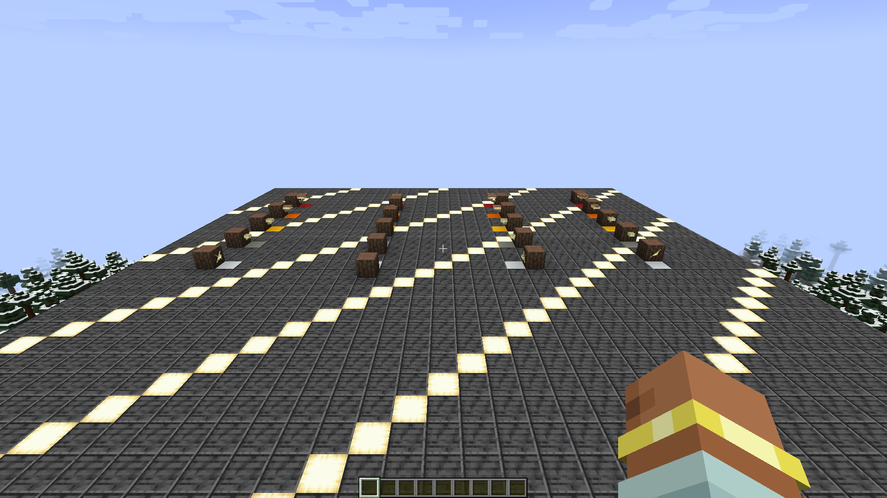
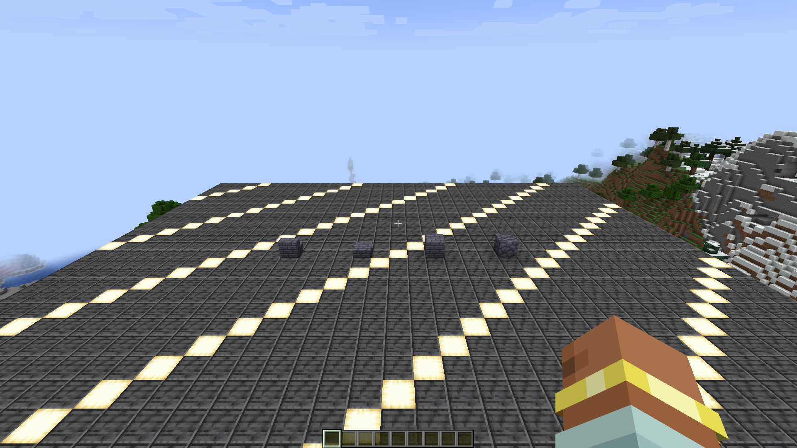

# Original Fabric 1.21.1 evidence

This archive preserves native evidence from the separately isolated original
Etherology runtime. It is the `published-0.1.7` binary reference, not the
unbound `source-0.1.8` tree.

## `pedestal-v14` — accepted, permanently consumed

The profile `etherology-original-fabric-1.21.1-published-0.1.7-v14` consumed
its sole native launch on 2026-09-04. The published `0.1.7` Fabric 1.21.1
client and v1.4.3 harness passed all 74 ordered assertions, captured four
unedited native 1920x1080 framebuffers, and completed the full integrated-world
restart with exact Pedestal state and inventory persistence. The accepted
contract retains authoritative server drops, the exact client block-state
snapshot, and all five client block-entity/removal predicates. Transient client
item-entity drop-map equality is diagnostic only, not a pass/fail readiness
condition. The preserved runtime must never be launched again. See
[`pedestal-v14`](pedestal-v14/) for the immutable accepted record and its
bounded coverage.

## `pedestal-v13` — consumed transition-mirror diagnostic

The repository-owned profile
`etherology-original-fabric-1.21.1-published-0.1.7-v13` consumed its sole native
launch on 2026-09-04. Its v1.4.2 harness completed the gallery phase and wrote
one native 1920x1080 `pedestal-gallery.png` capture. It then timed out after
6,000 stage ticks in `WAITING_FOR_CLIENT_MIRROR` for `transition-drops`.

The failed report records 49 of 74 assertions true. The interrupted transition
capture, persistence, restart, reopened-world, and three later screenshot
records include fail-closed or unexecuted values rather than independent
Pedestal mechanic failures. The native client and controller shut down cleanly
and the game log ends with `All dimensions are saved`, but the controller
correctly rejected the incomplete four-screenshot inventory. No controller
verification was published. V13 is diagnostic, not accepted evidence; its
compact record is under [`pedestal-v13`](pedestal-v13/), and its preserved
runtime must never be launched again.

V13 proved the five exact client transition block/block-entity predicates, but
its capture-readiness predicate also required a transient client item-entity
drop map to equal the authoritative server drop map. The retained artifacts do
not record that client map, so the mismatch's cause is unknown. The accepted
v14 successor made only this transient equality diagnostic while retaining the
server drops, exact client block/block-entity checks, and all 74 assertions.

## `pedestal-v12` — consumed failure diagnostic

The repository-owned profile
`etherology-original-fabric-1.21.1-published-0.1.7-v12` consumed its sole native
launch on 2026-09-04. Its v1.4.1 harness reached a fresh integrated world, then
failed closed at client tick 155 because the redstone-powered dispenser
fixtures did not receive exactly one scheduled activation each. All eight
fixtures at `x<0` remained unfired; all four at `x>=0` fired exactly once. This
exact chunk split indicates harness scheduling nondeterminism, not original
direction-specific Pedestal behavior, as the best-supported inference; the
retained runtime cannot prove the scheduler cause conclusively.

The harness published a failed 74-assertion report and hash-bound failed marker
at 16:52:51 Europe/Madrid, with no screenshot. Its scheduled stop then hung at
`Saving worlds`; the controller reached its 1,800-second deadline, killed its
owned process group, and returned exit code `2`. There is no clean shutdown or
controller verification, so v12 is not accepted evidence. Its compact,
hash-bound record is under [`pedestal-v12`](pedestal-v12/). The preserved
runtime must never be launched again. V13 later consumed its own separate
launch and is recorded above; v14 is the accepted, permanently consumed successor.

## `pedestal-v11` — consumed timeout diagnostic

The repository-owned profile
`etherology-original-fabric-1.21.1-published-0.1.7-v11` consumed its sole native
launch on 2026-09-04. The published `0.1.7` client reached a fresh integrated
world, but the controller's 1,800-second deadline expired before the v1.4.0
harness published a report, completion marker, controller verification, or any
of the four planned screenshots. The controller returned exit code `2`, so v11
is not accepted evidence and establishes no native Pedestal behavior.

Two saved player snapshots preserve the same pose away from the exact camera
contract. Together with the hash-pinned harness control flow, that supports a
camera-readiness-loop diagnosis, but only as an inference because no harness
telemetry was published. The compact, hash-bound diagnostic record is under
[`pedestal-v11`](pedestal-v11/). The ignored runtime remains preserved and must
never be run again. V12 later consumed its own separate launch and is recorded
above; neither profile may be reused.

## `phase0-smoke-v1`

The repository-owned profile
`etherology-original-fabric-1.21.1-published-0.1.7-v1` completed its one native
run on 2026-08-31 at 17:35 Europe/Madrid. The controller verified all 30 ordered
assertions, 120 consecutive ready renders, the unedited 1920x1080 framebuffer,
the forced world save, clean client shutdown, immutable launcher inputs, and
report-before-marker publication.

The image shows the live integrated-world fixture: Ethereal Storage on the
left, the Empowerment Table in the center, the Brewing Cauldron on the right,
and the animated Armillary Sphere behind the table. It proves the exact four
blocks and block-entity types were present on both server and client and that
their original models rendered. It does not by itself prove brewing,
empowerment, transmutation, inventory, or Ether-transfer behavior.

- Screenshot SHA-256:
  `aa69505119804f49936b6f0549566a25744010c96a0a5ac4f9064f3c4b0cafdb`
- [`report.json`](phase0-smoke-v1/reports/report.json): exact assertion record
- [`done.marker`](phase0-smoke-v1/reports/done.marker): report-hash-bound final
  publication marker
- [`verification.json`](phase0-smoke-v1/controller/verification.json):
  controller verification record
- [`original-client.log`](phase0-smoke-v1/controller/original-client.log):
  complete native client log
- [`archive-manifest.json`](phase0-smoke-v1/archive-manifest.json): hashes,
  capture times, controller identity, runtime locks, and artifact provenance

The client made the normal failed Realms authorization attempt associated with
its deliberately offline token; this appears in the complete log and did not
affect the integrated world or any of the 30 accepted assertions. The skin cache
remained absent.

## `forest-lantern-v2`

The fresh repository-owned profile
`etherology-original-fabric-1.21.1-published-0.1.7-v2` completed its sole native
run on 2026-08-31 at 22:51 Europe/Madrid. The controller verified 36 ordered
assertions, 120 consecutive ready renders, one unedited 1920x1080 framebuffer,
the forced world save, clean client shutdown, immutable launcher inputs, and
report-before-marker publication. Provisioning and launch consulted zero
external game profiles, and the mutable skin cache remained absent.

The live integrated-world gallery contains all 20 combinations of age `0..4`
and horizontal facing. The machine record additionally proves the exact block
and item registries, properties and default state, distinct network state IDs,
client/server mirrors, shears speed `15.0`, empty immature loot, the one-item
mature drop, the three crumb cooking recipes, the leather recipe, and a real
seeded `PlayerEntity.jump()` that broke one mature lantern and dropped exactly
one lantern. The gallery states were deliberately arranged for comparison; the
image is not evidence of natural growth or world generation.

- Screenshot SHA-256:
  `733aa553bb841c76e471bd9e5f65a3a3c178a095241ed33261f63a1eebf1aa1f`
- [`report.json`](forest-lantern-v2/reports/report.json): exact 36-assertion record
- [`done.marker`](forest-lantern-v2/reports/done.marker): report-hash-bound final
  publication marker
- [`verification.json`](forest-lantern-v2/controller/verification.json):
  controller verification record
- [`original-client.log`](forest-lantern-v2/controller/original-client.log):
  complete native client log
- [`archive-manifest.json`](forest-lantern-v2/archive-manifest.json): hashes,
  capture times, controller identity, runtime locks, and artifact provenance

## `attrahite-block-registry-v4`

The fresh repository-owned profile
`etherology-original-fabric-1.21.1-published-0.1.7-v4` completed its sole native
run on 2026-09-01 at 01:56 Europe/Madrid. The controller accepted all 49 ordered
assertions, 120 consecutive ready renders, the unedited 1920x1080 framebuffer,
the forced world save, clean client shutdown, immutable launcher inputs, and
report-before-marker publication. The consumed v3 profile was not reused, no
external game profile was consulted, and the mutable skin cache remained
absent.

The live integrated-world gallery shows the four registered blocks: Attrahite,
Attrahite Bricks, the brick slab, and the brick stairs. The machine record also
proves their four block items, runtime classes, exact default states and state
counts, stable network IDs, block and item tags, nine recipes, four loot tables,
Silk Touch behavior, deterministic plain-tool and Fortune III outcomes, and
saved-world persistence. It does not establish natural ore generation.

- Screenshot SHA-256:
  `61a405e33b09c2d55c117776c8c1f1bae8906be14f8104b676553e85eb97ab09`
- [`report.json`](attrahite-block-registry-v4/reports/report.json): exact
  49-assertion record
- [`done.marker`](attrahite-block-registry-v4/reports/done.marker):
  report-hash-bound final publication marker
- [`verification.json`](attrahite-block-registry-v4/controller/verification.json):
  controller verification record
- [`original-client.log`](attrahite-block-registry-v4/controller/original-client.log):
  complete native client log
- [`archive-manifest.json`](attrahite-block-registry-v4/archive-manifest.json):
  hashes, capture times, controller identity, runtime locks, and artifact
  provenance

## `slitherite-block-registry-v10`

The fresh repository-owned profile
`etherology-original-fabric-1.21.1-published-0.1.7-v10` completed its sole
native run on 2026-09-04 at 08:35 Europe/Madrid. The controller accepted all
185 ordered assertions, two unedited 1920x1080 framebuffer captures, exact
save/disconnect/reopen persistence, clean client shutdown, immutable launcher
inputs, and report-before-marker publication. Provisioning and launch consulted
zero external game profiles, and the mutable skin cache remained absent.

The gallery contains the complete 17-member Slitherite decorative family. The
machine record additionally proves exact registries, runtime classes, default
states and all 1,262 state network IDs; canonical visual resources; block and
item tags; loot; recipes and advancements; real `BlockItem` placement; the
polished button pulse/reset; item-versus-living pressure-plate behavior; and
structural/data equality after reopening the saved world. The initial and
reopened frames have a `0.001390` material-change ratio at the declared
maximum-channel delta threshold of 24 and a `6.280167` mean maximum-channel
delta.

- Initial screenshot SHA-256:
  `57c867a7591b0593a17c71091c0d27b2d16720350623d4c5a71fc56298ad4872`
- Reopened screenshot SHA-256:
  `450fc61f3bd9d385229cfa4dfb645b49c56660b5c17a600a6b7946402b7c9053`
- [`report.json`](slitherite-block-registry-v10/reports/report.json): exact
  185-assertion record
- [`done.marker`](slitherite-block-registry-v10/reports/done.marker):
  report-hash-bound final publication marker
- [`verification.json`](slitherite-block-registry-v10/controller/verification.json):
  controller verification record
- [`original-client.log`](slitherite-block-registry-v10/controller/original-client.log):
  complete native client log
- [`archive-manifest.json`](slitherite-block-registry-v10/archive-manifest.json):
  hashes, capture times, controller identity, runtime locks, artifact
  provenance, and declared visual-drift bounds
